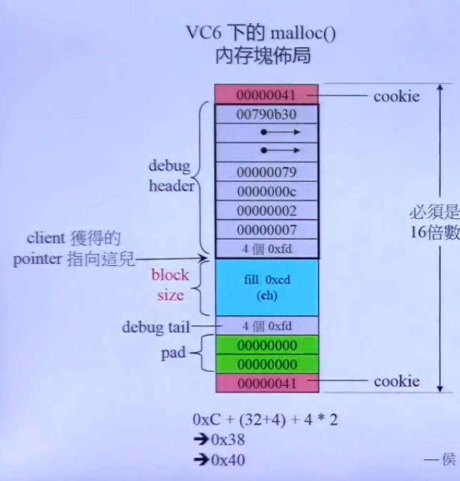
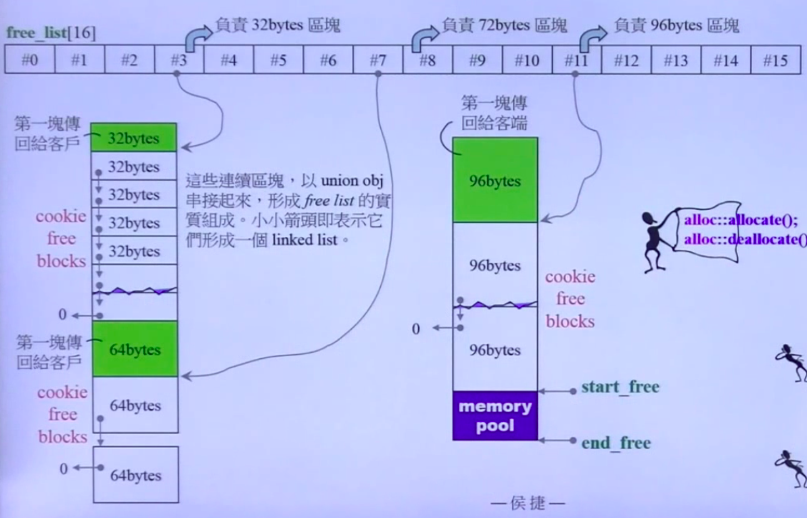

# C++ 内存管理

- new expression: (注意不是operator new)
  1. 通过operator new(size)调用malloc
  2. 强制转型
  3. 调用构造函数并指向，不可以直接调用构造函数，除非placement new
  
  ```C++
  Complex* pc = new Complex(1, 2);
  // ----->
  Complex* pc;
  try{
      void* mem = operator new(sizeof(Complex));  // 内部是malloc
      pc = static_cast<Complex*>(mem);
      pc->Complex::Complex(1, 2);
  }
  ```

- delete expression
  1. 调用析构函数
  2. 释放内存 (free)
  
  ```C++
  Complex* pc = new Complex(1, 2);
  delete pc;
  // ----->
  pc->~Complex();
  operator delete(pc);  // 内部是free
  ```

- array new和array delete
  - 一次new/delete一个数组，调用多次ctor和dtor

  ```C++
  Complex* pca = new Complex[3];
  // 唤起三次ctor，不能用参数给初值，所以该类必须有默认构造函数
  delete[] pca;
  // 唤起三次ctor
  ```

  ```C++
  class A{
  public:
    int id;
    A() : id(0) {cout << "default ctor, this=" << this << ", id=" << id << endl};
    A(int i) : id(i) {cout << "ctor, this=" << this << ", id=" << id << endl};
    ~A() {cout << "default dtor, this=" << this << ", id=" << id << endl};
  };
  A* buf = new A[size];  // 从上往下构造
  A* tmp = buf;
  
  for (int i = 0; i < size; ++i) {
      new (tmp++) A(i);   // placement new
  }
  delete[] buf;           // 从下往上析构
  // array new 的对象个数会被写进new出来的地址中
  ```

- placement new
  - 在已有的内存地址上调用构造函数，需要在已经malloc的地址上进行调用，内部通过operator new(size, p)调用malloc
  - new(p)或operator new(size, void*)

  ```C++
  char* buf = new char[sizeof(Complex) *3];
  Complex* pc = new(buf) Complex(1, 2);
  delete[] buf;
  // ----->
  Complex* pc;
  try{
      void* mem = operator new(sizeof(Complex, buf));  // 内部是malloc
      pc = static_cast<Complex*>(mem);
      pc->Complex::Complex(1, 2);
  }
  ```

- 如果类重载了operator new, 调用构造函数的时候会首先调用类中重载的operator new，也可以重新定义::operator new, ::operator delete
- 如果重载operator new, 第一参数必须是 size_t
- 也可以重载operator delete, 应该与重载的 operator new相对应，只有对应的operator new调用失败以后，才会调用对应的 delete函数
  
  ```C++
  class Foo {
  public:
      int id;
      long data=0;
      string str="";
  
      Foo(): id(0) {cout << "default ctor," << " id: " << id << " this: " << this << endl;}
      Foo(int i): id(i) {cout <<"ctor," << " id: " << id << " this: " << this << endl;}
      ~Foo() = default;
      static void* operator new(size_t size);
      static void operator delete(void* pdead, size_t size);
      static void* operator new[](size_t size);
      static void operator delete[](void* pdead, size_t size);
  
  };
  
  void* Foo:: operator new(size_t size) {
      Foo* p = (Foo*)malloc(size);
      cout << "my own new, size: " << size << " p: " << p << endl;
      return p;
  }
  
  void Foo::operator delete(void* pdead, size_t size) {
      cout << "my own delete: pdead: " << pdead << " size: " << size << endl;
      free(pdead);
  }
  
  void* Foo::operator new[] (size_t size) {
      Foo* p = (Foo*)malloc(size);
      cout << "my own new[], size: " << size << " p: " << p << endl;
      return p;
  }
  
  ```

- 单类内存管理
  - 第一版，每次malloc一大块内存，并且用指针指向下一块可用内存
  
  ```C++
  #include <cstddef>
  #include <iostream>
  using namespace std;  
  class Screen
  {
  public:
      Screen(int x) : i(x){};
      int get() { return i; }
      void *operator new(size_t);
      void operator delete(void *, size_t);  
  private:
      Screen *next;
      static Screen *freeStore;
      static const int screenChunk;  
  private:
      int i;
  };
  Screen *Screen::freeStore = 0;
  const int Screen::screenChunk = 24;  
  void *Screen::operator new(size_t size)
  {
      Screen *p;
      if (!freeStore)
      { // 当前剩余freeStore为空，一次需要重新new一大片空间，并且以freeStore为头
          size_t chunk = screenChunk * size;
          freeStore = p = reinterpret_cast<Screen *>(new char[chunk]);
          //
          for (; p != &freeStore[screenChunk - 1]; ++p)
              p->next = p + 1;
          p->next = 0;
      }
      // p指向当前freeStore，表示下一个要分配的空间，freeStore指向下一个空地址
      p = freeStore;
      freeStore = freeStore->next;
      return p; // 返回分配的空间，可以在这上面调用定点构造函数
  }  
  void Screen::operator delete(void *p, size_t)
  {
      // 将删除的地址插入到freeStore前端，注意此时可以不连续，但是有指针指向。分配时是数组，之后按照链表来使用
      (static_cast<Screen *>(p))->next = freeStore;
      freeStore = static_cast<Screen *>(p);
  }  
  ```

  - 第二版，使用union结构体，以及嵌入式指针
  
  ```C++
  class Airplane
  {
  private:
      struct AirplaneRep
      {
          unsigned long miles;
          char type;
      };

  private:
      union // 嵌入式指针，构造的时候看做指针，之后用来存数据
      {
          AirplaneRep rep;
          Airplane *next;
      };
  
  public:
      unsigned long getMiles() { return rep.miles; }
      char getType() { return rep.type; }
      void set(unsigned long m, char t)
      {
          rep.miles = m;
          rep.type = t;
      }
  
  public:
      static void *operator new(size_t size);
      static void operator delete(void *deadObject, size_t size);
  
  private:
      static const int BLOCK_SIZE;
      static Airplane *headOfFreeList;
  };
  Airplane *Airplane::headOfFreeList;
  const int Airplane::BLOCK_SIZE = 512;
  
  void *Airplane::operator new(size_t size)
  {
      if (size != sizeof(Airplane)) // 这里可能会由于继承，导致size不对
          return ::operator new(size);
      Airplane *p = headOfFreeList;
      if (p) // 如果p 有效，FreeList移到下一个元素
          headOfFreeList = p->next;
      else
      { // freelist已空，重新分配一块空间
          Airplane *newBlock = static_cast<Airplane *>(::operator new(BLOCK_SIZE * sizeof(Airplane)));
          // 将小块串成一个list，但跳过0，因为将会被返回为本次结果
          for (int i = 1; i < BLOCK_SIZE - 1; ++i)
              newBlock[i].next = &newBlock[i + 1];
          newBlock[BLOCK_SIZE - 1].next = 0; // end of list
          p = newBlock;
          headOfFreeList = &newBlock[1];
      }
      return p;
  }
  
  void Airplane::operator delete(void *deadObject, size_t size)
  {
      if (deadObject == 0)
          return;
      if (size != sizeof(Airplane))
      {
          ::operator delete(deadObject);
          return;
      }
      Airplane *carcass = static_cast<Airplane *>(deadObject);
      carcass->next = headOfFreeList; // 这里利用嵌入式指针，将该union的next指向之前的空节点
      headOfFreeList = carcass;
  }
  ```
  
  - 注意，这两版最后都没有将new出来的空间还给操作系统，但是没有发生内存泄露
  - 第三版：独自一个类，定义allocator，用一个指针指向内存池，专门用来分配内存。这样所有类都可以调用
  
  ```C++
  class Allocator
  {
  private:
      struct obj
      {
          struct obj *next; // embedded pointer
      };
  
  public:
      void *allocate(size_t);
      void deallocate(void *, size_t);
  
  private:
      obj *freeStore = nullptr;
      const int CHUNK = 5;
  };
  
  void Allocator::deallocate(void *p, size_t)
  {
      ((obj *)p)->next = freeStore;  // 将传入的地址强制转型成obj类型
      freeStore = (obj *)p;
  }
  
  void *Allocator::allocate(size_t size)
  {
      obj *p;
      if (!freeStore)
      {
          size_t chunk = CHUNK * size;
          freeStore = p = (obj *)malloc(chunk);
  
          for (int i = 0; i < (CHUNK - 1); ++i)
          {
              p->next = (obj *)((char *)p + size);
              p = p->next;
          }
          p->next = nullptr;
      }
      p = freeStore;
      freeStore = freeStore->next;
      return p;
  }

  // 调用时：
  class Foo
  {
  public:
      long L;
      string str;
      static Allocator myAlloc;
  
  public:
      Foo(long l) : L(l) {}
      static void *operator new(size_t size) { return   myAlloc.allocate(size); }
      static void operator delete(void *pdead, size_t   size) { return myAlloc.deallocate(pdead, size); }
  };
  Allocator Foo::myAlloc;
  ```

- 第四版：利用宏进行规范化
  
  ```C++
  #define DECLARE_POOL_ALLOC()                                           \
  public:                                                                \
      void *operator new(size_t size) { return myAlloc.allocate(size); } \
      void operator delete(void *p) { myAlloc.deallocate(p, 0); }        \
                                                                         \
  protected:                                                             \
      static Allocator myAlloc;

  #define IMPLEMENT_POOL_ALLOC(class_name) \
      allocator class_name::myAlloc;
  
  class Foo {
      DECLARE_POOL_ALLOC()
  public:
      long L;
      string str;
  public:
      Foo(long l): L(l){}
  };
  IMPLEMENT_POOL_ALLOC(Foo)
  ```

- new handler
  - 当operator new没能力分配申请的memory，会抛出一个std::bad_alloc exception.
  - 可以让更多memory可用，或者调用abort() 或 exit()

- 标准库 allocator
  - VC6 下的malloc布局：两个cookie，debug header + debug tail, 数据部分，还可能有padding部分，保证16字节倍数对齐
  
  

  - G2.9 std::alloc
    - 存在一个free_list，list长为16，每个元素是一个指针，负责8的整数倍的内存的分配，指向下一个可分配的地址

    
    - 分配规则：
      - 每次新分配20*2块对应的内存，前20块为对应的内存大小，使用嵌入式指针。剩下的20块作为备用空间，可以分配给不同大小的对象，
      - 当备用区域分配完了，会重新分配20*2块内存，大小和新请求的对象大小一致，同样20为使用区域，剩下20为备用区域。中间的block都是cookie free的block
      - 如果对象请求的字节数不是8的倍数，会被对齐到8的倍数
      - deallocate的时候会根据指向该地址的指针下标确定该地址的大小，并利用嵌入式指针释放内存
      - 如果对象大小大于 8 * 16，会由malloc分配带cookie的block
      - 每次新分配之前会检查pool里有没有剩余空间，以及剩余空间大小。如果不够一个对象大小，新分配一块内存，大小为： ```Cur_class_size*20*2 + RoundUp(last_required_size >> 4)```，否则至多在池中分配20个空间。若大小与之前对象大小不同，首地址会由对应链表元素指向

      - 池中余量不足一个元素的时候，即碎片，会将这个碎片由对应大小的链表指向，作为可分配区域，再申请新的内存空间
      - 如果系统分配不了足够大的内存，会从比该对象大的对象的空白部分取出后面的部分的一个元素大小做pool，并且分配给该对象，剩下的部分做为新的pool，之后再按照之前的规则进行分配
      - 如果右边没有空的链表，可以对申请的空间进行折半分配，直到需要的大小或可申请，但是没有这么做。也可以从前面比较小的进行合并，但难度极大，也没有这么做
      - 实在不行就分配不了了。
      - 代码中会将不属于该系统的内存进行回收，如果这块内存不是8的倍数，会产生严重的问题