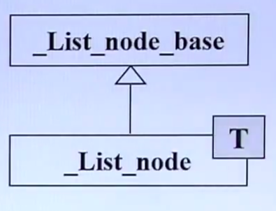
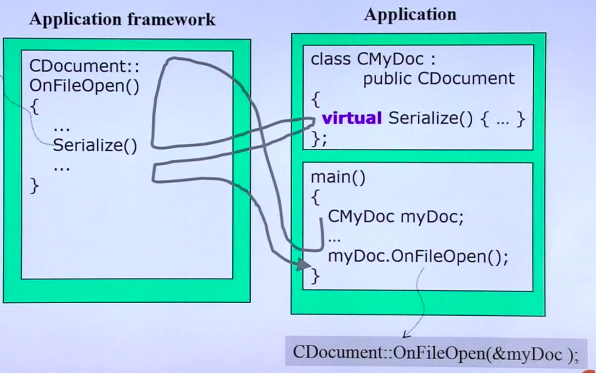
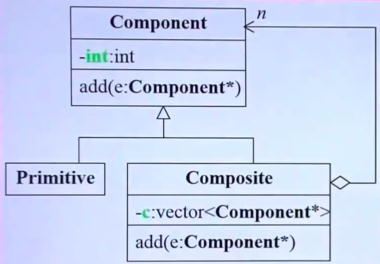
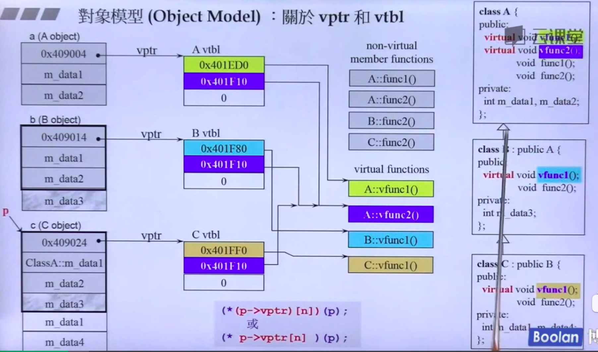
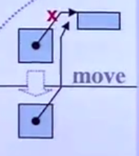

# OOP
- inline function:
  函数在class本体（头文件）内定义完成，自动成为inline function，inline函数和宏一样，预定义阶段完成替换，节省函数每次调用的额外开支，但会占用额外存储空间。**是否变成inline function由编译器自己决定，inline只是一个建议**

  在后面出现的，不在函数本体之中，可以加inline.

- public: 
  外界可以访问
- private:
  只有自己类可以访问
- constructor: (ctor, 构造函数)
  构造函数名称与类的名称相同，可以拥有参数，参数可以有默认实参，没有返回值。只有构造函数可以有初始化列表。用初始化列表相当于初始化，如果在大括号里面用等于，相当于赋值，相当于放弃了初始化的机会，效率会差一些。
  ```C++
  class complex
  {
  public:
    complex (double r = 0, double i = 0) : re(r), im(i) {}
    // complex() : re(0), im(0) {}
    // 此时这个函数不能被定义，因为上面的函数有默认值，r = 0, i = 0, 此时定义complex c1 的时候，编译器会找不用传参的构造函数，而两个函数此时都满足，出现二义性，不会编译。
    complex& operator += (const complex&);
    double real() const { return re; }
    double imag() const { return im; }
  private:
    double re, im;
    friend complex* __doapl (complex*, const complex&);
  }
  ```
- 编译器会将重载函数改名，所以不存在两个名称完全相同的函数。
- 构造函数的ctors放在private中，此时构造函数不能被调用，在Singleton设计模式中有这样的应用。此时只允许存在一个A对象。将该对象放在类的static类里，外界调用只能通过本类定义的getInstance()函数。
  ```C++
  class A {
  public:
    static A% getInstance();
    setup() {...}
  private:
    A();
    A(const A& rhs);
    ...
  };
  
  A& A::getInstance() 
  {
      static A a;
      return a;
  }
  ```
- 在函数后面加const：该函数不可以改变该对象中的数据内容。
  ```C++
  double real() const { return re; }
  ```
  不改变对象中的数据的函数一定要加const，如果不加的话，下面的例子编译不通过：
  ```C++
  const complex c1(2, 1);
  cout << c1.real();    //此时编译器认为real()函数会改变该对象的值，而对象本身为常量，所以编译不通过。
  cout << c1.imag();
  ```
- 参数传递：pass by value vs. pass by reference (to const)
  - pass by value 会将传递的对象整体压入函数栈。
  - pass by reference 会将对象的地址传进去。
  - **参数传递最好传引用，速度会快。**
  - const 引用传递不可以改变被传递参数的值。
- 返回值传递：return by value vs. return by reference (to const)
  ```C++
  complex& operator += (const complex&);
  ```
  **在可以的情况下，尽量传reference**
- friend: 友元
  ```C++
  friend complex& __doapl(complex*, const complex&);
  ```
  - 友元可以自由获得private的成员。友元会打破封装。
  - 相同class的各个objects互为 friends 友元。
  ```C++
  class complex
  {
  public:
    complex(double r = 0, double i = 0) : re(r), im(i) {}
    int func (const complex& param) {
        return param.re + param.im;
    }
  private: 
    double re, im;
  }
  ```

- **类设计准则：**
  1. 数据要放在private里
  2. 函数参数要用reference来传递
  3. 函数返回值在可以的情况下要用reference来返回
  4. 类中的函数该加const要加
  5. 构造函数要用initialize list进行初始化
- 如果返回值本身有地址，可以返回引用，否则不可以。
- 操作符重载
  - 编译器看见二元运算符，会将这个操作符作用在前面的对象上：
  ```C++
  inline complex& __doapl(complex* ths, const complex& r) {
      ths->re += r.re;
      ths->im += r.im;
      return *ths;
  }
  inline complex& complex::operator+=(const complex& r) {
      return __doapl(this, r);
  }
    c2 += c1
  //^~ 相当于
  // c2.operator+=(c1)
  // 调用时相当于：
  inline complex& complex::operator+= (this, const complex& r){
  //                                   ^~~~ 编译器自动添加，不一定是第一个位置，取决于编译器，这个 this 是调用者的地址，此时this是c2的地址。
      return __doapl(this, r);
  }
  // 返回&可以连续赋值， 所以不可以返回void
  c3 += c2 += c1;
  // c1 先加到 c2上，再将 c2 加到 c3身上
  ```
  - 所有成员函数一定带有一个隐藏参数，this，this指向调用者
- 函数前面有 类名::说明是成员函数，如果没有，说明是全域函数。
- 非成员函数的操作符重载：
  ```C++
  inline complex operator + (const complex& x, const complex& y) {
      return complex (real(x) + real(y), imag(x), imag(y));
  }
  inline complex operator + (const complex& x, double y) {
      return complex(real(x) + y, imag(x));
  }
  inline complex operator + (double x, const complex& y) {
      return complex(x + real(y), imag(y));
  }
  // 这些函数不可以return by reference, 因为这些返回值是local object, typename() (typename + ()) 会创建一个临时对象。
  // complex(), complex(4, 5), 生命值仅仅存在于本行
  ```

  **应该放在类头文件中**，与成员函数区别在于**没有this指针**，编译器在找对应函数的时候，可能先去找成员函数操作符重载，也可能会找非成员函数操作符重载。
  ```C++
  // 单元运算符定义
  inline complex operator + (const complex& x)
  {
      return x;
  }
  inline complex operator - (const complex& x) {
      return complex(-real(x), -imag(x));
  }
  cout << -c1;
  ```
  **非成员操作符重载将类外对象作为左边的对象：**
  ```C++
  inline bool operator == (double x, const complex& y) {
      return x == real(y) && imag(y) == 0;
  }
  complex c;
  cout << (0 == c);
  ```
  - <<操作符的重载 (output operator), 只能写成全局重载
  因为操作符默认作用在左边的操作数上，但左边的是cout, 没有定义成员函数可以接受complex类型。返回值是ostream，可以进行链式编程
  ```C++
  #include <iostream>
  ostream& operator << (ostream& os, const complex& x) {
      return os << "(" << real(x) << ', ' << imag(x) << ')';
  }
  ```
- 编译器自带的拷贝赋值函数会将对应对象忠实的拷贝过去，所以带着指针的对象不行，只能将指针拷贝过来。
- 带指针的类：
  ```C++
  class String{
  public:
    // big three
    String(const char* cstr = 0);   // 构造函数
    String(const String& str);      // 拷贝构造函数，接收的是自己这种东西
    String& operator=(const String& str); // 拷贝赋值，接收的类是自己这种东西
    ~String();
    char* get_c_str() const { return m_data; }
  private: 
    char* m_data;
  }

  inline String::String(const char* cstr = 0) {  // 构造函数，传入一个其他对象
      if (cstr) {
          m_data = new char[strlen(cstr) + 1];
          strcpy(m_data, cstr);
      }
      else {  // 未指定初值
          m_data = new char[1];
          *m_data = '\0';
      }
  }

  inline String::~String() {
      delete[] m_data;
  }

  inline String::String(const String* str) {  // 拷贝构造函数，传入一个自身的对象
      m_data = new char[strlen(str.m_data) + 1];
      strcpy(m_data, str.m_data);
  }

  inline String& String::operator=(const String& str) {  // 拷贝赋值函数，重载等号，传入一个自身的对象
    if (&str == this) {
        return *this;
    }
    // 如果没有这一块，当发生自我赋值的时候，会将原有空间杀掉，自己不在存在char* 
    delete[] m_data;
    m_data = new char[strlen(str.m_data) + 1];
    strcpy(m_data, str.m_data);
    return *this;
  }

  #include <iostream>
  ostream& operator << (ostream& os, const String& str) {
      os << str.get_c_str();
      return os;
  }
  ```
- class with pointer members 必须要有 copy ctor 和 copy op=， 否则会出现内存泄漏，默认赋值只能将指针拷贝过去
- **变量生命周期**：
  1. stack object在作用域结束之后自动消失
  1. static local object 的生命在作用域结束之后仍然存在，直到程序结束
  2. global object 写在任何大括号之外，在main函数结束之后才消失
  1. heap objects的生命周期在delete之后才会结束，不delete就内存泄露
- new 会先分配memory在调用ctor. 
  ```C++
  Complex* pc = new Complex(1, 2);
  --> 
  void* mem = operator new (sizeof(Complex)); // 分配内存
  pc = static_cast<Complex*>(mem);            // 转型
  pc->Complex::Complex(1 ,2);                 // 调用构造函数
  // Complex::Complex(pc, 1, 2)               // this为调用这个函数的指针。成员函数：谁调用成员函数，谁就是this。

  delete ps;
  -->
  String::~String(ps);                        // 析构函数
  operator delete(ps);                        // 释放内存，内部调用free(ps)
  ```
- 数组new如果不搭配数组delete, 会造成内存泄漏。
  如果不搭配array delete, 只会对地址空间第一个元素调用析构函数，即**数组第0个元素**，内存泄漏情况取决于数组对象中有没有指针，如果有指针，会造成其他对象内存泄露，如果没有指针，不会出现问题。
- 判断是否返回reference: 如果目的端本来就存在，就可以返回reference
- static 成员变量和 static 成员函数
  ```C++
  complex c1, c2, c3;
  cout << c1.real();
  cout << c2.real();
  --> 
  cout << complex::real(&c1);
  cout << complex::real(&c2);
  //                   ~~~~~
  //                   this
  ```
  - non static 成员变量可以通过this访问，所有对象在新建的时候会将non static的成员变量重新分配一份。
  - 加了static的成员变量（静态数据），只有一份。
  - 加了static的成员函数（静态函数）没有this pointer，所以不可以像成员函数一样，通过this pointer去处理成员的数据。**所以静态函数只能处理静态成员**
  ```C++ 
  class Account {
  public:
    static double m_rate;
    static void set_rate(const double& x) { m_rate = x; }
  };
  double Account::m_rate = 8.0;  // 定义了静态变量的类，在外面一定要有这一行，在类外要进行初始化，如果没有初值，会被初始化成0
  // 静态成员不占用对象空间，而是单独开辟一块空间，与普通static变量类似，都在内存区中的全局数据区分配内存
  // 全局数据区的变量都有默认的初始值 0，而动态数据区（堆区、栈区）变量的默认值是不确定的，一般认为是垃圾值。

  int main() {
      Account::set_rate(5.0);    // 静态函数可以通过class name 调用

      Account a;
      a.set_rate(7.0)            // 也可以通过对象进行调用
  } 
  ```
  ```C++
  // Meyers 单例模式：没有调用不会创建对象，调用以后永远存在，直到程序结束
  class A {
  public:
    static A& getInstance();
    setup() {...}
  private:
    A();
    A(const A& rhs);
    ...
  };

  A& A::getInstance() {
      static A a;  // 静态变量只会被创建一次
      return a;   
  }
  ```
- 函数模版
  ```C++
  template <class T>
  inline const T& min(const T& a, const T& b){
      return b < a ? b : a;
  }
  ```
- 对象刚定义的时候，即使使用 = ，调用的也是构造函数
- explicit关键字：
  - 指定构造函数或者转换函数为显式，即不能用于隐式转换和复制初始化。
  ```C++
  // https://zhuanlan.zhihu.com/p/52152355
  #include <iostream>
  using namespace std;
  class Point {
  public:
      int x, y;
      /*explicit*/ Point(int x = 0, int y = 0)
              : x(x), y(y) {}
  };
  void displayPoint(const Point& p)
  {
      cout << "(" << p.x << ","
          << p.y << ")" << endl;
  }
  int main()
  {
      displayPoint(1); // 运行到此，会进入Point构造函数, x = 1, y = 0
      Point p = 1;     // 这里也会进入，且传入参数为 x = 1, y = 0
  }
  // 如果构造函数前面有explicit，不能像这样隐式调用，编译器报错：
  // no viable version from int to Point.
  ```
- operator type() const; 用来定义类型转换
  ```C++
  int operator int() const {}
  ```

# OOP
1. Inheritance (继承)
2. Composition (复合)
3. Delegation (委托)

- Composition: 表示has-a
  queue中的deque, queue中有一个deque, 用黑色菱形表示，菱形一端为容器，容纳了另一端

  
  - 从内存角度看，composition的内存会相加，composition的容器会含有所有被包含类型的大小。
  - 构造和析构：
    - 构造由内而外，先构造Component part的default构造函数，然后才执行自己(编译器执行)
    ```C++
    Container::Container(...) : Component() {...};
    //                          ^~~~~~~~~
    ```
    - 析构由外而内，container的析构函数先执行自己，然后调用Component的析构函数。
    ```C++
    Container::~Container(...) {... ~Component() };
    //                              ^~~~~~~~~~
    ```
- Delegation: Composition by reference.
  
  
  ```C++
  class StringRep;
  class String {     // Handle 编译防火墙
  public:
    String();
    String(const char* s);
    String(const String& str);
    String& operator = (const String& str);
    ~String();
  private:
    StringRep* rep; 
  }
  class StringRep {  // Body
      friend class String;      // 友元类，一个类 A 可以将另一个类 B 声明为自己的友元，类 B 的所有成员函数就都可以访问类 A 对象的私有成员。
        StringRep(const char* s);
        ~StringRep();
        int count;
        char* rep;
  };
  // 可以实现引用计数
  // 利用copy on write 来实现修改
  ```
  - 与 composition的区别：Component 的生命周期不和container同步
- 继承，表示 is-a

  
  ```C++
  struct _List_node_base {
      _List_node_base* _M_next;
      _List_node_base* _M_prev;
  };

  template<typename _Tp> struct _List_node : public _List_node_base {
      _Tp _M_data;
  }
  ```
  - 从内存角度：子类对象里面，有父类的成分在里面，内存叠加
  - 构造由内而外：子类的构造函数首先调用父类的构造函数
  ```C++
    Derived::Derived(...) : Base() {...} ;
  ```
  - 析构由外而内：析构函数首先执行自己，然后调用父类的析构函数
  ```C++
    Derived::~Derived(...) {... ~Base()};
  ```
  - **注意：父类的析构函数必须是virtual的，否则会出现undefined behavior**，只要认为父类可能被继承，就要定义虚析构函数
- Inheritance with virtual function
    ```C++
    class Shape {
    public:
        virtual void draw() /*const*/ = 0;      // pure virtual
        virtual void error(const std::string& msg); // impure virual
        int objectID() const;    // non-virtual
    }

    class Rectangle: public Shape{...}
    class Ellipse: public Shape{...}
    ```
  - 继承函数相当于继承函数的调用权
  - 函数种类：
    - non-virtual函数：不希望derived class 重新定义它（override, 复写）
    - virtual函数：希望derived class 重新定义，而且已经对它有默认定义
    - pure virtual函数：希望derived class 一定要override
  - override函数调用顺序
  ```C++
  CDovument::OnFileOpen() {
      ...
      Serialize() // 通过this寻址到子类
      ...
  }
  class CMyDoc: public CDocument {
      virtual Serialize() {...}
  };
  main() {
      CMyDoc myDoc;
      ...
      myDoc.OnFileOpen();  // 该函数为父类函数，通过子类调用父类函数，函数名为 CDocument::OnFileOpen(&myDoc);
  }
  ```
  
    - 首先通过子类对象调用父类函数：myDoc.OnFileOpen();
    - 遇到子类重写的 Serialize(), 会调用子类重写的函数
    - 再返回父类函数，结束调用
    - Template Method: 将父类写好一些函数，将某些动作延迟到子类去做
- Inheritance + Composition关系下的构造和析构
  - 子类既继承了Base又有Component的时候，会先调用base的构造函数，再调用component的构造函数，再调用自己的构造函数
  - 子类里面有一个父类，父类里面又有一个Component，此时先构造Component，再构造base，再构造derived
- **最经典的设计模式：Delefation + Inheritance**
  ```C++
  class Subject {
      int m_value;
      vector<Observer*> m_views;  // 存有几个窗口
  public:
      void attach(Observer* obs) {  // 注册窗口
          m_view.push_back(obs);
      }
      void set_val(int value) {
          m_value = value;
          notify();
      }
      void notify() {             // 对每个窗口调用update
          for (int i = 0; i < m_view.size(); i++) {
              m_views[i]->update(this, m_value);
          }
      }
  }

  class Observer {
  public:
    virtual void update(Subject* sub, int value) = 0;
  }
  ```
- OOP例子： Composit
- 容器里面放内容一定要一样大小，但组合模式里面的对象不一定大小相同，所以只能放指针
- 子类对象转化为父类对象需要强制类型转换，而子类对象指针可以自动转化为父类指针
  
  ```C++
  class Component {
      int value;
  public:
      Component(int val) : value(val) {...}
      virtual void add(Component*) {}
  };

  class Primitive: public Component {
  public:
      Primitive(int val): Component(val) {} 
  };

  class Composite: public Component {
      vector<Component*> c;
  public: 
      Composite(int val): Component(val) {}
      void add(Component* elem) {
          c.push_back(elem);
      }
  }
  ```
  - OOP 例子：Prototype
  
# 续集
- 转换函数：将A类对象转换为B类对象
  ```C++
  class Fraction {
  public:
    Fraction(int num, int den = 1) : m_numerator(num), m_denominator(den) {}  // non-explicit-one-argument ctor
    operator double() const {   // 将Fraction类转换成double类，不需要返回值
        return ((double)m_numerator / m_denominator)
    }
    Fraction operator+ (const Fraction& f) {
        return Fraction(...);
    }
  private:
    int m_numerator;
    int m_denominator;
  }

  Fraction f(3, 5);
  double d = 4 + f  // 此时调用类型转换，想办法把Fraction变成double()，调用定义的operator double()，此时 + 作用在double上，后面再调用operator double()转换类型。如果变成
  // double = f + 4, 此时operator+会与 Fraction(num, den = 1)产生二义性，报错
  ```
  ```C++
  class Fraction {
  public: 
    Fraction(int num, int den = 1) : m_numerator(num), m_denominator(den) {}
    Fraction operator+(const Fraction& f) {
        return Fraction(...);
    }
  private:
    int m_numerator;
    int m_denominator;
  }
  Fraction f(3, 5);
  Fraction d2 = f + 4; //此时编译器会想办法把4变成Fraction类, 调用Fraction(4, 1);
  // 如果两个同时存在，会发生二义性，报错
  ```
- **explicit关键字：取消隐式调用，只能显式调用**
- pointer-like class, 智能指针
  ```C++
  template<class T> class shared_ptr {
  public:
    T& operator*() const { return *px; }
    T& operator->() const { return px; }
    shared_ptr(T* p) : px(p) {}  //将天然指针变成智能指针
  private:
    T* px;
    long* pn;
  }

  struct Foo {
      ...
      void method(void) {}
  };
  shared_ptr<Foo> sp(new Foo);
  Foo f(*sp);// operator*
  sp->method();// operator->， 变成 px->method()
  // 注意这里，箭头符号消耗掉以后，在C++里面，得到箭头符号，消耗掉了，会继续用箭头符号继续作用下去。
  ```
- member template，成员模板
  ```C++
  template <class T1, class T2>
  struct pair {
      typedef T1 first_type;
      typedef T2 second_type;

      T1 first;
      T2 second;

      pair() : first(T1()), second(T2()) {}
      pair(const T1& a, const T2& b) : first(a), second(b) {}

      template <class U1, class U2> pair(const pair<U1, U2>& p) : first(p.first), second(p.second) {}  // 成员模板
  }

  // 用处：
  pair<Derived1, Derived2> p;
  pair<Base1, Base2> p2(p);

  -->
  pair<Base1, Base2> p2(pair<Derived1, Derived2>());
  //   ^~~~~  ^~~~~          ^~~~~~~~  ^~~~~~~~
  //     T1     T2               U1         U2
  // 可以把 p2 的初值赋值给 p，只要 p2 的类型 U1, U2 可以转换为 T1 和 T2. 
  // C++中，子类可以转换为父类，父类不可转换为子类
  ```
- template template parameter, 模板模板参数
  ```C++
  // 允许用户第二参数传入一个模版
  template<typename T, template<typename T> class Container> class XCls {
  private:
    Container<T> c;
  public: 
    ...
  };
  template<typename T> using Lst = list<T, allocator<T>>;
  XCls<string, Lst> mylst; 
  // 注意不能传XCls<string, std::list> mylst; 此处默认参数不起作用
  ```
- variadic templates 
  ```C++
  void print() {}
  template<typename T, typename... Types> 
  void print(const T& firstArg, const Types&... args) {
      cout << firstArg << endl;
      print(args...);
  }
  ```
- 对于引用，编译器底部都是通过一根指针实现的，但要制造假象，所以size of reference和指代的对象一致，且对reference取地址，得到的和原对象也一致
- 参数传递时，以下被视为same signature:
  ```C++
  double imag(const double& im) {}
  double imag(const double im) {}
  ```
  函数后面的const会被视为函数签名的一部分，可以并存，同时存在时，非const对象会调用没有const签名的函数，const对象会调用有const签名的函数
  ```C++
  double imag(const double& im) {}
  double imag(const double im) const {}
  ```
  但变量上的const不会影响函数签名。故以下的函数不能并存
  ```C++
  double imag(const double& im) {}
  double imag(double im) {}
  ```
- vptr(虚指针)和vtbl(虚函数表)
  
  - 对于有虚函数的对象，对象大小会比所有数据大小加起来还大4，对因为多了一根指针（虚指针，vprt）指向虚函数表。
  - **动态绑定**：将调用过程与相应代码链接起来的行为，与给定的过程调用相关联的代码，只有在运行期间才可以知道。
  - **静态绑定**（前期绑定）指程序运行前就知道方法是属于哪个类的，编译的时候可以连接到类中，定位这个方法
  - 虚函数表存在于对象实例最前面的位置（为了保证正确取到虚函数的偏移量），所以可以通过对象实例的地址得到虚函数表，然后就可以遍历其中的函数指针
  - 对于继承而言，虚函数表在父类，子类继承父类会将虚函数表指针也继承下来。
  - vptr会经由vtbl找到对应的虚函数地址。vtbl里放的都是函数指针。每个类有几个虚函数，就虚函数表里就有几个指针，指向对应的函数。
  - 子类会继承父类的虚函数表，而且虚函数表里的函数指针指向地址不变，与父类虚函数指向相同的地址，即子类和父类共享虚函数。
  - 如果子类重写了父类的方法，子类对象中没有重写的虚函数还是用父类的，但有重写的就会另外开辟一块空间，重新分配，虚函数中对应的指向也会变化
  ```C++
  (*(p->vptr)[n])(p);
  // 此处顺序与虚函数定义顺序相同
  ```
  - **动态绑定的三个条件：（多态）**
    1. 通过指针来调用
    2. 指针可以向上转型（父类指针可以指向子类）
    3. 调用的是虚函数
   - 多态：可以通过父类指针调用子类对象（多态=虚函数表=动态绑定）
  - 虚函数用法：多态，或模板方法（Template method）
- this pointer:
  对每一个对象，this pointer指向自己本身的地址。用Template Method的例子，当函数调用到Serialize()函数的时候，会通过this指针调用（成员函数都是通过this指针调用），然后this是一个指向子类的指针，符合向上转型，而且Serialize函数又是一个虚函数，所以这里会通过动态绑定来调用对应的函数。
  ```C++
  Serialize();
  -->
  this->Serialize();        // this是一个指向myDoc的指针，Serialize虚函数定义在父类CDocyment里，通过子类对象调用父类方法，所以这里有向上转型，将指向子类的指针传到父类的函数里面，充当父类成员函数里的this，需要转型。
  (*(this->vptr)[n])(this); // 子类中重新定义了Serialize函数，所以根据虚函数表，会调用子类的函数
  ```
- 重载operator new, operator new[], operator delete and operator delete[]

记得回来补

- 右值引用
  定义：When right-hand side of an assignment is an rvalue, then the left-hand side object can steal resources from the right-hand side rather than performing a separate allocation, thus enabling move semantics.
  赋值语句的右端是一个右值的话，左手边的对象可以偷来对象的值，而不是重新分配一块空间
  - Lvalue: 可以出现在operator=左侧的对象
  - Rvalue: 只能出现在operator=右侧的对象
    - 临时对象是右值。简单来说，右值对象没有名称
  ```C++
  // int test
  int a = 9; 
  int b = 4;
  a = b // ok
  b = a // ok
  a = a + b // ok
  a + b = 42 // error

  //string test
  string s1("Hello");
  string s2("World");
  s1 + s2 = s2;     //通过编译
  cout << "s1:" << s1 << endl;  // s1: Hello
  cout << "s2:" << s2 << endl;  // s2: World
  string() = "World";           // 可以对临时变量赋值

  // complex test 
  complex<int> c1(3, 8), c2(1, 0);
  c1 + c2 = complex<int>(4, 9);  // 通过编译
  cout << "c1:" << c1 << endl;   // c1: (3, 8)
  cout << "c2:" << c2 << endl;   // c2: (1, 0)
  complex<int>() = complex<int>(4, 9); //可以对临时变量赋值
  ```
  - 不可以对Rvalue取reference
  - C++认为，当右值出现在operator=的右侧的时候，认为对其资源进行偷取/搬移而非拷贝是可以的。要求：
    1. 必须有语法让我们在调用端告诉编译器，这是一个Rvalue
    2. 必须有语法让我们在被调用端写出一个专门处理Rvalue的所谓的move assignment函数
    ```C++
    insert(..., &&x) // 本来是右值
    ```
  - 保持右值对象的空间不变，将左值的指针指向右值对象，原本右值对象不能再调用自己的值，所有权发生变化
  - **std::move**
    - 可以传左值，将传进函数的对象变成右值引用，并将左边的地址指向右边的对象。必须确保后续不会再调用传进函数的参数。
    ```C++
    M c1(c);
    M c2(std::move(c1));
    ```
  - **perfect forwarding**: perfect forwarding allows you to write a single function template that takes n arbitrary arguments and forwards them transparently to another arbitrary function. The nature of the argument (modifiable, const, lvalue or rvalue) is preserved in this forwarding process.
  - **unperfect forwarding**: 
    ```C++
    void process(int& i) {
        cout << "process(int&): " << i << endl;
    }
    void process(int&& i) {
        cout << "process(int&&):" << i << endl;
    }
    
    int a = 0;
    process(a);     // process(int&): 0 变量被视为lvalue
    process(1);     // process(int&&): 1 temp object被视为Rvalue处理
    process(std::move(a)); // process(int&&): 0 强制将a由Lvalue改为Rvalue

    void forward(int&& i) {  // 相当于中介，变量经forward再传给process
        cout << "forward(int&&): " << i << ", ";
        process(i);
    }

    forward(2);     // forward(int&&): 2, process(int&): 2 
    // Rvalue 经由forward() 传给另一个函数却变成了Lvalue.
    // 原因是传递过程中，它变成了一个named object
    forward(move(a)); // forward(int&&): 0, process(int&): 0
    // 出错
    forward(a);       // Error: cannot bind 'int' lvalue to 'int&&'
    const int& b = 1;
    process(b);       // Error: no matching function for call to 'process(const int&)'
    process(move(b)); // Error: no matching function for call to 'process(std::remove_reference<const int&>::type'
    int& x(5)         // Error: invalid initialization of non-const reference of type 'int&' from an rvalue of type 'int' 
    ```
  - perfect Forwarding: STL
    ```C++
    template<typename _Tp> constexpr _Tp&& forward(typename std::remove_reference<_Tp>::type& __t) noexcept { return static_cast<_Tp&&>(__t); }
    template<typename _Tp> constexpr _Tp&& forward(typename std::remove_reference<_Tp>::type&& __t) noexcept {
        static_assert(!std::is_lvalue_reference<_Tp>::value, "template argument substituting _Tp is an lvalue reference type");
        return static_cast<_Tp&&>(__t);
    }
    template<typename _Tp> constexpr typename std::remove_reference<_Tp>::type&& move(_Tp&& __t) noexcept { return static_cast<typename std::remove_reference<_Tp>::type&&>(__t); }
    ```
  - move-aware class
  ```C++
  class MyString{
  public:
    static size_t DCtor;    // default-ctor 次数
    static size_t Ctor;     // ctor 次数
    static size_t CCtor;    // copy-ctor 次数
    static size_t CAsgn;    // copy-asgn 次数
    static size_t MCtor;    // move-ctor 次数
    static size_t MAsgn;    // move-asgn 次数
    static size_t Dtor;     // dtor 次数
  private:
    char* _data;
    size_t _len;
    void _init_data(const char *s) {
        _data = new char[_len + 1];
        memcpy(_data, s, _len);
        _data[len] = '\0';
    }
  public:
    // default constructor
    MyString() ： _data(NULL), _len(0) {++DCtor;}

    // constructor
    MyString(const char* p) : _len(strlen(p)) {
        ++Ctor;
        _init_data(p);
    }

    // copy constructor
    MyString(const MyString& str) : _len(str._len) {
        ++CCtor;
        _init_data(str.data);
    }
    
    // move constructor
    MyString(MyString&& str) noexcept : _data(str._data), _len(str._len) {
        ++MCtor;
        str._len = 0;
        str._data = NULL;  // 重要
    }
    MyString& operator=(const MyString& str) {
        ++CAsgn;
        if (this == &str) {
            return *this;
        }
        delete[] _data;
        _init_data(str._data);
        _len = str._len;
        return *this;
    }
    // move assignment
    MyString& operator=(MyString&& str) noexcept {
        ++MAsgn;
        if (this != &str) {
            if (_data) 
                delete[] _data;
            _len = str._len;
            _data = str._data;  // MOVE
            str._len = 0;
            str._data = NULL;   // 重要，要打断pointer到原对象的指针，否则局部变量生命周期结束后，调用析构函数会杀掉原来的对象
        }
        return *this; 
    }

    // dtor
    virtual ~MyString() {
        ++Dtor;
        if(_data) {
            delete[] _data;    // 如果没有打断，这里在局部变量生命周期结束之后，将原对象杀掉。如果是NULL，什么都不用做
        }
    }
  }
  // 注意局部对象死亡的时候也会调用析构函数
  bool operator<(const MyString& rhs) const {
      return string(this->data) < string(rhs._data);
  }
  bool operator==(const MyString& rhs) const {
      return string(this->data) == string(rhs._data);
  }
  char* get() const { return _data; }
  size_t MyString::DCtor = 0;
  size_t MyString::Ctor = 0;
  size_t MyString::CCtor = 0;
  size_t MyString::CAsgn = 0;
  size_t MyString::MCtor = 0;
  size_t MyString::MAsgn = 0;
  size_t MyString::Dtor = 0;
  namespace std {
      template<> struct hash<MyString> {
          size_t operator() (const MyString& s) const noexcept {
              return hash<string>() (string(s.get()));
          }
      }
  }

  #include <typeinfo>
  template<typename T> void output_static_data(const T& myStr) {
      cout << typeid(myStr).name() << "--" << endl;
      cout << "CCtor=" << T::CCtor 
           << "MCtor=" << T::MCtor
           << "CAsgn=" << T::CAsgn
           << "MAsgn=" << T::MAsgn
           << "Dtor=" << T::Dtor
           << "Ctor=" << T::Ctor
           << "DCtor=" << T::DCtor
           << endl;
  }
  template<typename M, typename NM> void test_moveable(M c1, NM c2, long& value){
      char buf[10];
      typedef typename iterator_traits<typename M::iterator>::value_type
  }
  ```
  
  