# 操作系统
- 操作系统的演进
  - 无操作系统
    - 人工操作
    - 用户独占
    - CPU等待人工操作
    - 资源利用率很低
  - 批处理系统
    - 无需等待人工操作
    - 批量输入任务
    - 资源利用率提升
    - 多道程序设计
      - 早期批处理系统一次只能处理一个任务
      - 多道程序设计是的批处理可以一次处理多个任务
      - 指计算机内存中可以同时存放多个程序，互相不干扰
      - 多道程序在计算机的管理程序之下相互穿插运行
      - 对多道程序的管理是操作系统的重要功能
  - 分时系统
    - 人-机交互
    - 多用户共享
    - 及时调试程序
    - 资源利用率提升
- 操作系统的五大功能：
  - 进程管理
  - 存储管理
  - 作业管理
  - 文件管理
  - 设备管理
- 操作系统概览：
  - 定义：操作系统是管理计算机硬件和软件资源的计算机程序
  - 通过管理配置内存、决定资源供需顺序、控制输入输出设备等方式管理硬件资源
  - 提供让用户和系统交互的操作界面
  - **是管理硬件、提供用户交互的软件系统**
  - 操作系统的基本功能：
    - 操作系统**统一管理计算机资源**，如处理器、存储器、IO设备、文件等
    - 用户无需面向硬件接口编程，**实现对计算机资源的抽象**
    - **提供用户与计算机之间的接口**，分为系统调用、命令和图形窗口

    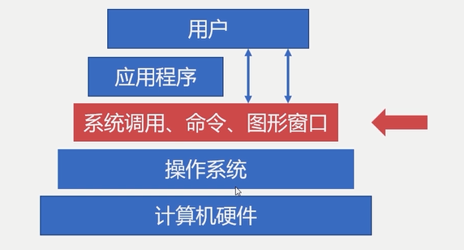

  - 操作系统的相关概念：
    - 并发性：
      - 并行是指两个或多个事件可以在**同一时刻**发生。多处理器一般强调并行。
      - 并发是指两个或多个事件可以在**同一时间间隔**发生，单处理器一般强调并发。
    - 共享性：
      - 操作系统中的资源可以提供给多个**并发**的程序共同使用。这种共同使用的形式称为资源共享，如多个程序可以同时使用主存资源
        - 互斥共享：当资源被程序A占用时，其他程序要想使用只能等待，只有A使用完以后，其他进程才可以使用该资源。强调某一时刻或较短的时间间隔
        - 同时访问：某种资源在一段时间内**并发地**被多个程序访问。这种“同时”是宏观的，从宏观去看，该资源可以被同时访问。强调一段时间内共享使用。
    - 虚拟性：把一个**物理实体**转变为若干个**逻辑实体**。物理实体是真实存在的，逻辑实体是虚拟的。虚拟技术主要有时分复用和空分复用
      - 时分复用：资源在时间上进行复用，不同程序**并发**使用
      - 多道程序分时使用计算机的硬件资源，提高资源的利用率
        - 虚拟处理器技术：借助多道程序设计技术，为每个程序建立进程，多个程序分时复用处理器
        - 虚拟设备技术：物理设备虚拟为多个逻辑设备，每个程序占用一个逻辑设备，多个程序通过逻辑设备**并发**访问
      - 空分复用技术：用来实现虚拟磁盘和虚拟内存等技术，提高资源利用率和编程效率
        - 虚拟磁盘技术：物理磁盘虚拟为逻辑磁盘。如C、D、E等逻辑盘
        - 虚拟内存技术：在逻辑上扩大程序的存储容量，可以使用比实际内存更大的容量
    - 异步性：在多道程序环境下，允许多个进程并发执行。进程在使用资源时可能需要等待或放弃。进程的执行并不是一气呵成的，而是以走走停停的形式推进
      - 进程以不可预知的速度向前推进，不知道程序何时执行、何时暂停、何时完成
- 进程管理：
  - 为什么需要进程：
    - 进程是系统进行资源分配和调度的基本单位
    - 进程作为程序独立运行的载体保障程序正常执行
    - 进程的存在是的操作系统资源的利用率大幅提升
  - 进程的实体：
    - 主存中的进程形态：由进程控制块（PCB, process control block）控制，是一块连续的地址空间，记录进程当前状态和控制进程运行的全部信息，使得进程是能够独立运行的基本单位。PCB是操作系统进行调度经常会被读取的信息，常驻于内存，存放在系统专门开辟的PCB区域内
      - 标识符：唯一标记一个进程，用于区别其他进程，进程ID
      - 状态：标记进程当前的状态，比如运行态
      - 程序计数器：指向进程即将被执行的下一条指令的地址
      - 内存指针：是程序代码、进程数据相关的指针
      - 上下文数据：存储进程执行时处理器存储的数据
      - IO状态信息：被进程IO操作占用的文件列表
      - 记账信息：使用处理器时间、时针数总和等
      - 分类：
        - 进程标识符（内部，外部）
        - 处理机状态（通用寄存器，指令计数器，PSW，用户的栈指针）
        - 进程调度信息（进程状态，进程的优先级，进程调度所需的其他信息、事件）
        - 进程控制信息（程序的数据地址，资源清单，进程同步和通信机制，链接指针）

      

    - 进程与线程：
      - 进程 Process
        - 进程是操作系统进行资源分配和调度的**基本单位**
        - 一个进程可以有多个线程
        - 操作系统对进程的调度，实际上是对进程中线程的调度
      - 线程 Thread
        - 线程是操作系统进行运行调度的**最小单位**
        - 线程包含在进程之中，是进程中实际运行的工作单位，实际运行逻辑的是进程里的线程
        - 一个进程可以并发多个线程，每个线程执行不同的任务
        - 进程的线程共享进程的资源
        
        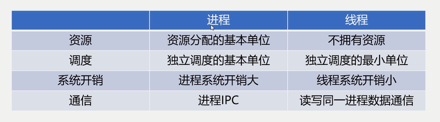

  - 五状态模型：
    - 就绪
      - 当进程被分配到除了CPU以外所有必要的资源后
      - 只要再获得CPU使用权，就可以立即运行
      - 其他资源都准备好（进程控制块，栈空间，堆空间，内存）、只差CPU资源的状态就为就绪状态
      - 操作系统中多个处于就绪状态的进程通常排成一个队列，称为就绪队列
    - 阻塞
      - 进程因某种原因（如其他设备未就而无法继续执行）从而放弃CPU的状态称为阻塞状态。
      - 操作系统中处于多个阻塞状态的进程组成阻塞队列
    - 执行
      - 进程获得CPU，其程序正在执行，称为就绪状态
      - 在单处理机中，在某个时刻只能有一个进程是处于执行状态
    - 就绪状态由**进程调度**获得CPU资源，切换到执行状态。执行状态**时间片用完**，切换为就绪状态。执行状态由IO请求切换到阻塞状态，阻塞状态因为IO完成，切换到就绪状态
    
    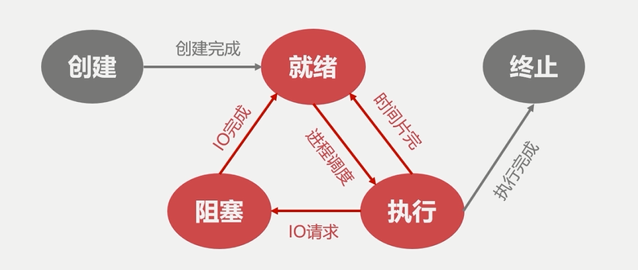

    - 创建
      - 分配PCB -> 插入就绪队列
      - 创建进程时**拥有PCB**但**未拥有其他资源尚未就绪**的状态称为创建状态，通过fork函数创建进程
    - 终止
      - 系统清理 -> 归还PCB
      - 进程结束由系统清理或归还PCB的状态称为终止状态
  - 进程同步
    - 生产者消费者问题，由于多进程并发执行，对缓冲区操作不同步，导致数据异常。缓冲区数据称为临界资源
    
    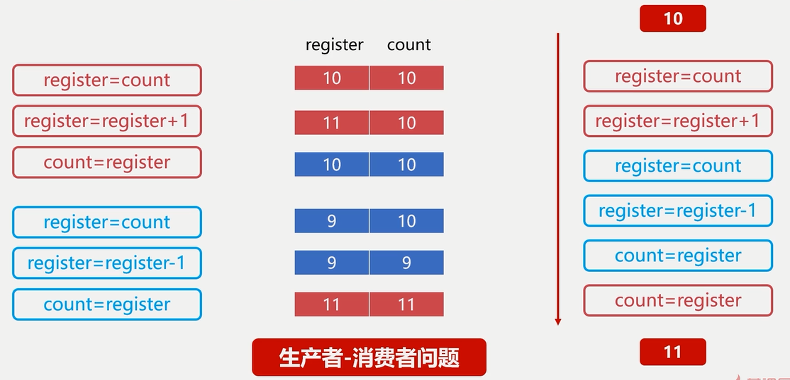
    
    - 哲学家进餐问题，由于多进程，发生死锁
    - 问题根源是没有进程间的通信，**对竞争资源在多进程间进行使用次序的协调，使得并发执行的多个进程之间可以有效使用资源和相互合作**
    - 临界资源：一些虽然作为共享资源却又无法同时被多个线程共同访问的共享资源。当有进程在使用临界资源时，其他进程必须依据操作系统的同步机制等待占用进程释放该共享资源才可以重新竞争，使用共享资源

    - 同步原则：
      - 空闲让进：资源无占用，允许使用
      - 忙则等待：资源有占用，请求进程等待
      - 有限等待：保证有限等待时间能够使用资源
      - 让权等待：等待时，进程需要让出CPU（阻塞状态）
  - 线程同步：
    - 进程内多线程也需要同步，原理同进程同步，只不过线程共享内存，进程需要通信
- Linux进程管理：
  - 进程类型：
    - 前台进程
      - 具有终端，可以与用户交互的进程。执行时占用shell，其他输入命令无效
    - 后台进程
      - 没有占用终端。优先级比前台进程低。将需要执行的命令以 & 结束
      ```shell

      ```
    - 守护进程
      - 特殊的后台进程，在系统引导时启动，一直运行到系统关闭
  - 进程ID
    - 进程ID是进程的唯一标记，每个进程拥有不同的ID（PCB中的数据）
    - 进程ID是一个非负整数，最大值由操作系统限定
    - 进程层级关系：父进程调用fork()函数，创建子进程。层级关系可以通过**pstree**命令查看
    - ID为0的进程为idle进程，是系统创建的第一个进程
    - ID为1的进程是init进程，是0号进程的子进程，完成系统初始化。
    - Init进程是所有用户进程的祖先进程
  - 进程的标记
    - R: 运行状态
    - S: 睡眠状态
    - D: 进程正处于IO等待的睡眠状态
    - T: 进程正处于暂停状态
    - Z: 进程正处于退出状态，或僵尸进程
  - 操作Linux进程的相关命令：
    - ps: 列出当前进程
      - -aux: 打印进程相关信息，用户，id，运行时间
      - -u 用户名：查看相关用户的进程
      - -aux | grep 'python3'
    - top: 查看当前进程全部信息
    - kill: 发送指定信号给进程
- 作业管理
  - 进程调度：计算机通过决策决定哪个**就绪进程**可以获得CPU使用权，需要保留旧进程的运行信息（请出旧进程）并且选择新进程，准备运行环境并分配CPU
    - 进程调度机制：
      - 就绪队列的排队机制：将就绪进程按照一定的方式排成队列，以便调度程序可以最快找到就绪进程
      - 选择运行进程的委派机制：调度程序以一定策略选择就绪进程，将CPU资源分配给它
      - 新老进程的上下文切换机制：保存当前进程的上下文信息，装入被委派执行进程的运行上下文。将老进程的上下文从CPU高速缓存中移到主存中，再将新进程的上下文装入CPU高速缓存
    - 非抢占式的调度：处理器一旦分配给某个进程，就让该进程一直使用下去，知道完成工作或因为IO阻塞才会让出处理器
    - 抢占式调度：允许调度程序以一定策略暂停当前运行的进程，需要保存好旧进程的上下文信息，处理器分配给新的进程

    
  
    - 调度算法：
      - 先来先服务调度算法：
        - 按照就绪队列，按顺序进行分配
      - 短进程优先调度算法：
        - 调度程序优先选择就绪队列中估计运行时间最短的进程进行计算
      - 高优先权优先调度算法：
        - 进程附带优先权，调度程序优先选择权重高的进程（前台/后台进程）
      - 时间片轮转调度算法：按先来先服务原则排列就绪进程，每次从队头取出待执行进程，分配一个时间片执行。相对公平，但不能保证及时响应用户
      - 多级反馈队列调度算法 [https://blog.csdn.net/fuzhongmin05/article/details/55802925]
  - 死锁：两个或两个以上的进程在执行过程中，由于**竞争资源**或者由于**彼此通信**而造成的一种阻塞现象。若无外力作用，它们都将无法推进下去。永远在互相等待的进程称为死锁进程
    - 死锁的产生：
      - 竞争资源
        - 共享资源数量不满足各个进程需求
          - 等待请求的资源被释放
          - 自身占用资源不释放
      - 进程调度顺序不当
    - 死锁的四个必要条件
      - 互斥条件
        - 进程对资源的是**排他性使用**
        - 某资源只能由一个进程使用，其他进程需要使用只能等待
      - 请求保持条件
        - 进程至少保持一个资源，又提出新的资源请求
        - 新资源被占用，请求被阻塞
        - 被阻塞的进程不释放自己保持的资源
      - 不可剥夺条件
        - 进程获得的资源在未完成使用前不能被剥夺
        - 获得的资源只能由进程自身释放
      - 环路等待条件
        - 发生死锁时，必然存在进程-资源环形链
    - 死锁的处理：
      - 预防死锁的方法：
        - 摒弃请求保持条件：
          - 系统规定进程运行之气那，一次性申请所有需要的资源
          - 进程在运行期间不会提出资源请求，从而没有请求保持条件
        - 摒弃不可剥夺条件：
          - 当一个进程新请求的资源得不到满足时，必须释放占有的资源
          - 进程运行时占有的资源可以被释放，意味着可以被剥夺
        - 摒弃环路等待条件：
          - 可用资源**线性排序**，申请必须按照需要递增申请。线性申请不再形成环路
      - 银行家算法：
        - 所需资源表 - 已分配资源表 = 还需分配资源表
        - 用可分配资源表与还需分配资源表的每个进程进行对比，将资源分配给可以全部满足的进程
        - 某进程完成后，释放资源，再进行下一轮
- 存储管理：
  - 确保计算机有足够的内存处理数据，确保程序可以从可用内存中获取一部分内存使用，确保程序可以归还使用后的内存以供其他程序使用
  - 内存分配
    - 单一连续分配：
      - 只能在单用户、单进程的操作系统中使用
      - 将内存分为两块连续的空间，一块是系统区，一块是用户区
    - 固定分区分配：
      - 支持多道程序
      - 内存空间被划分为若干固定大小的区域，每个分区只提供给一个程序使用，互不干扰
    - 动态分区分配：
      - 动态分区空闲表数据结构：

      
      
      - 动态分区空闲链数据结构：

      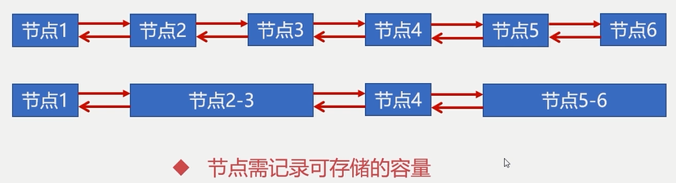

      - 首次适应算法（FF算法）
        - 分配内存时从开始顺序查找合适的内存区
        - 如果没有合适的空闲区，则该次分配失败
        - 每次从头部开始，使得头部地址空间不断被划分（可用循环适应算法改进）
      - 最佳适应算法（BF算法）
        - 要求空闲区链表按照容量大小排序
        - 遍历空闲区链表找到最佳合适空闲区
        - 可避免大材小用
      - 快速适应算法（QF算法）
        - 要求有多个空闲区链表
        - 每个空闲区链表存储一种容量的空闲区
  - 内存回收
    - 空闲区 -> 回收区
      - 不需要新建空闲链表节点，只需要把空闲区的容量增大即可
    - 回收区 -> 空闲区
      - 将回收区与空闲区合并，新的空闲区使用回收区的地址
    - 空闲区1 -> 回收区 -> 空闲区2
      - 将空闲区1, 回收区, 空闲区2合并，将空闲区1的地址作为新的空闲区地址
    - 回收区
      - 为回收区创建新的空闲节点，并插入到相应的空闲区链表中
  - 段页式存储管理（物理内存，进程角度）
    - 页式存储管理
      - 字块是相对物理设备的定义，页面时相对逻辑空间的定义。指的是大小一样的一块内存
      - 将进程逻辑空间等分成若干大小的页面，相应的把物理内存空间分成与页面大小一样的物理块。以页面为单位把进程空间装进物理内存中分散的物理块
      - 内存碎片：空闲链表中节点一部分被占用，其他一部分会称为内存碎片
      - 页面大小应该适中，过大会难以分配，过小会导致内存碎片过多。页面大小通常是 512B~8K

      

      - 页表：记录进程逻辑空间与物理空间的映射

      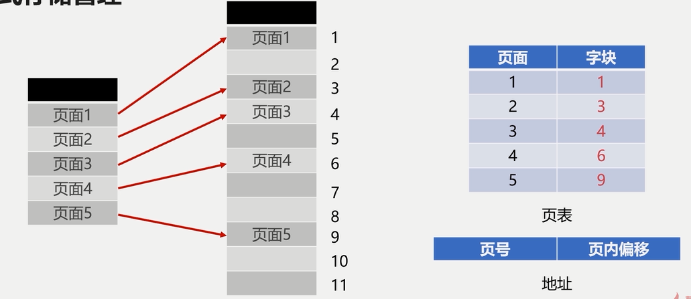

      - 存在问题：逻辑地址空间一般在2^32 ~ 2^64，会使页表变得非常大，占用很大的内存空间。32位逻辑地址空间的分页系统，规定页面大小为4KB，则在每个进程页表中页表项可达1M个，如果每个页表项占用1Byte，每个进程仅仅页表就要占用1MB的内存空间
      - 多级页表：根页表存的是次级页表的地址，一个根页表可以指向多个次级页表，根据根页表调用的字块，如果对应次级页表没有在内存空间里，则加载。
      - 有一段连续的逻辑分布在多个页面中，将大大降低执行的效率
    - 段式存储管理
      - 将进程逻辑空间划分为若干段（非等分），段的长度由连续逻辑的长度决定。（比如程序中一段连续的代码，一个函数等）

      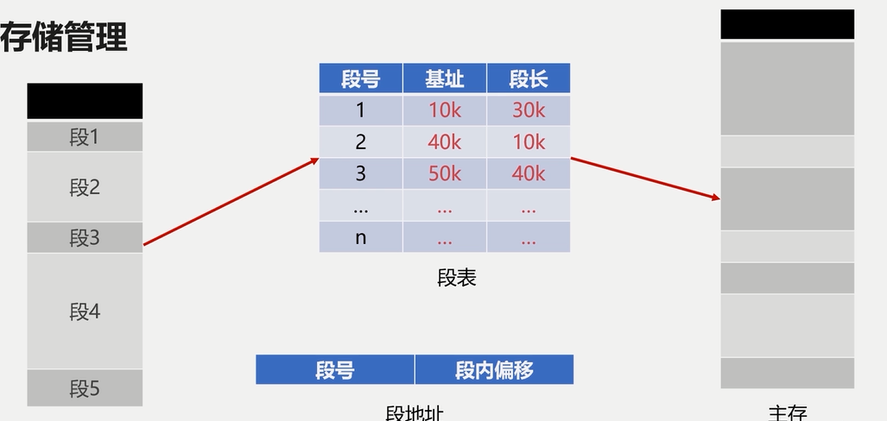

    - 段式页式对比：
      - 页是物理单位，段是逻辑单位
      - 分页是为了合理利用空间，分段是满足用户要求
      - 页大小由硬件固定，段长度可动态变化
      - 页表信息是一维的，段表信息是二维的
    - 段页式存储管理
      - 先将逻辑空间按段式管理分成若干段
      - 再把段内空间按页式管理等分成若干页
      - 段页地址：段号 | 段内页号 | 页内地址
  - 虚拟内存
    - 把程序使用内存划分，将部分暂时不用的内存放置在辅存。虚拟内存时对物理内存的补充，速度接近于内存，成本接近于辅存

    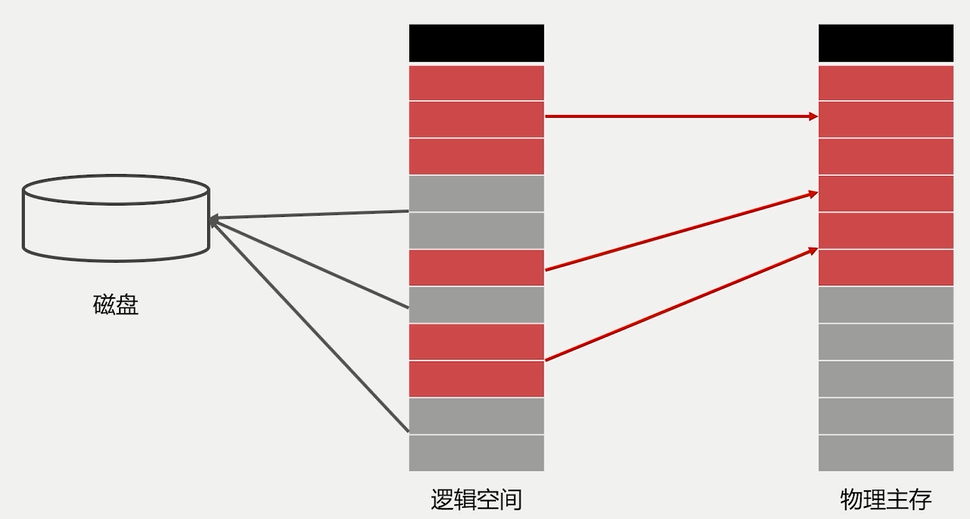
    
    - 根据程序的局部性原理，（CPU访问存储器时，无论是存取指令还是存取数据，所访问的存储单元都趋于聚集在一个较小的连续区域中）程序运行时，无需装入全部内存，装载部分即可。如果访问页不在内存，则发出缺页中断，发起页面置换
    - 置换算法：
      - FIFO
      - LFU
      - LRU
    
    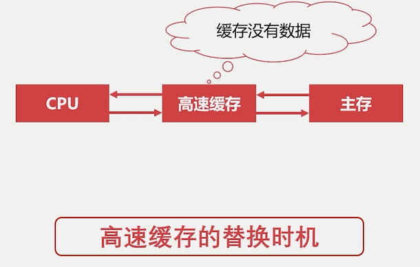
    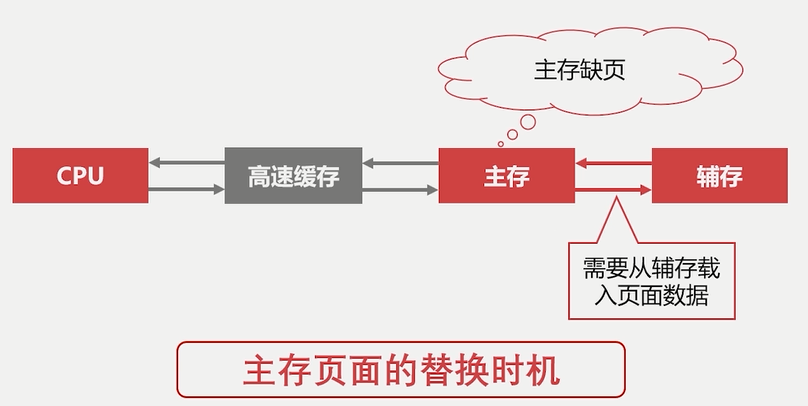

  - Linux存储管理：
    - 页内碎片是已经被分配出去（能明确指出属于哪个进程）的内存空间大于请求所需的内存空间，不能被利用的内存空间就是内部碎片
    - 页外碎片是指还没被分配出去（不属于任何进程），但是由于大小而无法分配给申请内存空间的新进程的内存空闲块
    - Buddy内存管理算法：
      - 努力让内存分配与相邻内存合并能快速进行
      - 分配原则：每块内存分配时都向上取整为2的幂大小（将内存外碎片转译成内存内碎片问题）
      - 伙伴：一片连续内存的“伙伴”是相邻的另一片大小一样的连续内存（用于快速合并空闲区域）
      - 创建一系列空闲链表，每一种都是2的幂
      - 分配时，先将所需的大小上取整，从该块应该在的空闲链表往最大空闲链表方向查找，直到找到有空闲内存块的链表。找到后，将得到的内存块往上分配，多余的挂在大于该块的空闲链表上，直到找到目标内存块。
      - 回收时，如果发现被回收内存的伙伴在空闲链表上，向下合并直到空闲链表上没有伙伴或者到达最大空闲链表
    - Linux交换空间：
      - 是磁盘的一个分区，Linux物理内存满时，会把一些内存交换至Swap空间。Swap空间是初始化系统时配置的
      - 是冷启动内存的依赖，系统睡眠依赖，大进程空间依赖。
      - 与虚拟内存对比：
        - 共同点：
          - 都位于磁盘，都与主存发生置换
        - 不同点：
          - Swap空间是操作系统概念，解决系统物理内存不足的问题
          - 虚拟内存是进程概念，解决物理内存不足的问题
- 文件管理：
  - 文件逻辑结构
    - 有结构文件：
      - 文本文件，文档，媒体文件
      - 文件内容由定长记录（文件格式，文件描述等结构化数据项）和可变长记录组成（文件具体内容）
    - 无结构文件：
      - 二进制文件，链接库（流式文件）
      - 文件内容长度以字节为单位
    - 顺序文件：
      - 顺序文件指按顺序存放在存储介质中的文件，是所有逻辑文件当中存储效率最高的
      - 增删改效率很低
    - 索引文件：
      - 需要配合索引表完成存储的操作，索引表每个键值对的值指向的是实际存储的位置
  - 辅存的存储空间分配
    - 辅存分配方式
      - 连续分配
        - 将文件存储在所需大小的连续扇区上
        - 顺序读取文件内容非常容易，对存储要求高，要求满足容量的连续存储空间。
      - 链接分配
        - 将文件存储在离散的盘块中。
        - 需要额外的存储空间存储文件的盘块链接顺序。
        - 隐式分配：下一个链接指向存储在**当前盘块内**。适合顺序访问，随机访问效率低，可靠性差，任何链接出问题都会影响文件（类似于链表）
        - 显式分配：使用文件定位表（File Allocation Table FAT）存储物理块对应的下一盘块位置。不支持高效的直接存储（FAT记录项多），检索时FAT表占用较大的存储空间（需要将整个FAT加载到内存中）
      - 索引分配：（当前主流）
        - 把文件所有盘块集中存储（索引），读取文件时，将文件索引读进内存即可

        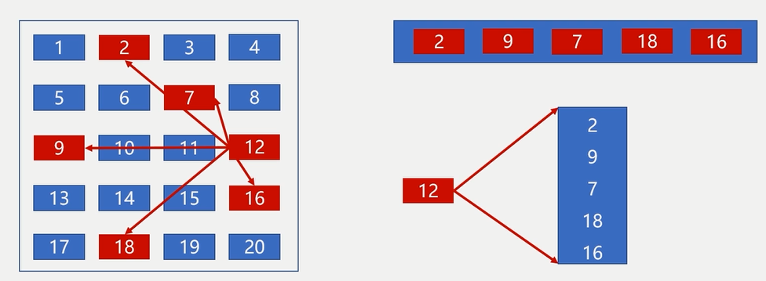
        
    - 存储空间管理
      - 空闲表
        - 存储磁盘里第一个空闲的盘块号，以及对应的空闲盘块数
      - 空闲链表
        - 把所有空闲盘区组成一个空闲链表，每个链表节点存储空闲盘块和空闲的数目
      - 位示图

      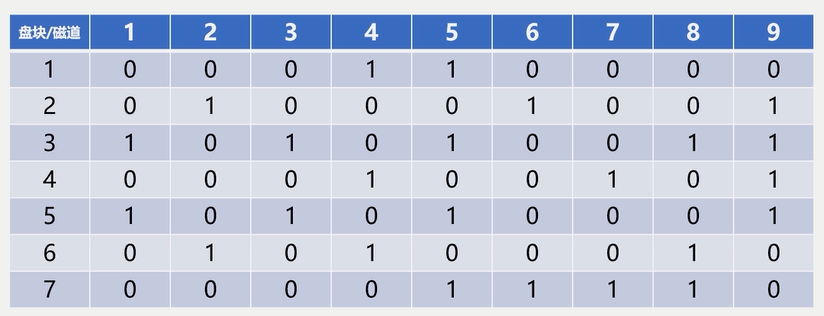

  - 目录管理
    - 利用目录树进行管理，叶子节点可能为目录或文件，目录可以继续带节点，表示该目录下文件或子目录，文件必为叶子节点
  - 文件系统分类
    - FAT(File Allocation Table):用于windows
      - 使用一张表保存盘块信息
    - NTFS(New Technology System):均可
    - EXT2/3/4(Extended file system), 用于Linux
  - Linux文件系统
    - 目录结构
    
    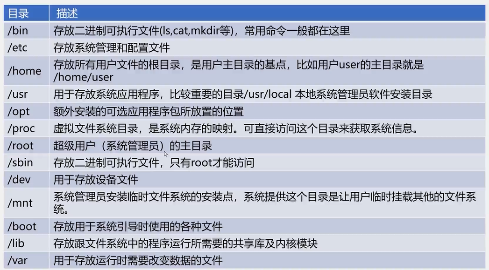
    
    - EXT文件系统：
      - Boot Sector: 启动扇区，安装开机管理程序
      - Block Group: 块组，存储数据的实际位置
      - Inode table: 存放每个Inode的地方，每个文件/目录都有一个Inode，是每一个文件/目录的索引节点（索引方式管理外存）
      - Inode: 存放文件类型、权限、物理地址、长度、连接计数、存取时间、文件状态、索引节点编号（唯一）、文件状态、访问计数、链接指针。注意，文件名不存放在文件Inode，而是存放在目录的Inode节点上，这样列出目录文件时，无需加载文件Inode
      - Inode Bitmap: Inode的位示图，记录已分配和未分配的Inode
      - Data block: 存放文件内容的地方，每个block都有唯一的编号，文件的block记录在文件的Inode上
      - Block bitmap: 记录data block使用情况
      - Superblock: 记录整个文件系统相关信息，如Block和Inode使用情况，以及时间信息，控制信息等，一般为1024bit
      - Inode是文件唯一标记，而不是文件名

      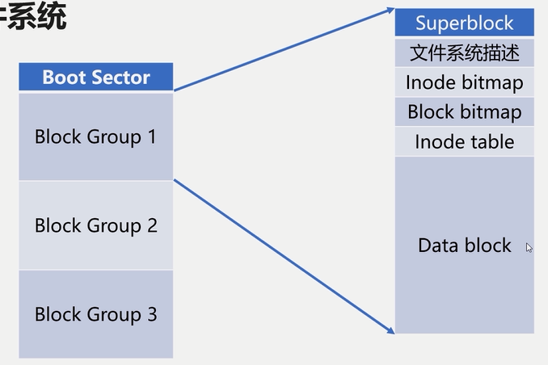

- 设备管理
  - 广义IO设备
    - 对CPU进行数据输入输出的设备
    - 分类
      - 按使用特性
        - 存储设备
          - U盘
          - 内存
          - 磁盘
        - 交互IO设备
          - 键盘
          - 显示器
      - 按信息交换单位
        - 块设备
          - 磁盘
          - SD卡
        - 字符设备
          - 打印机
          - Shell终端
      -  按设备的共享属性分类：
        - 独占设备
        - 共享设备
        - 虚拟设备
      - 按传输速率分类：
        - 低速设备
        - 中速设备
        - 高速设备
  - IO设备缓冲区
    - 减少CPU处理IO请求的频率
    - 提高CPU与IO设备之间的并行性

    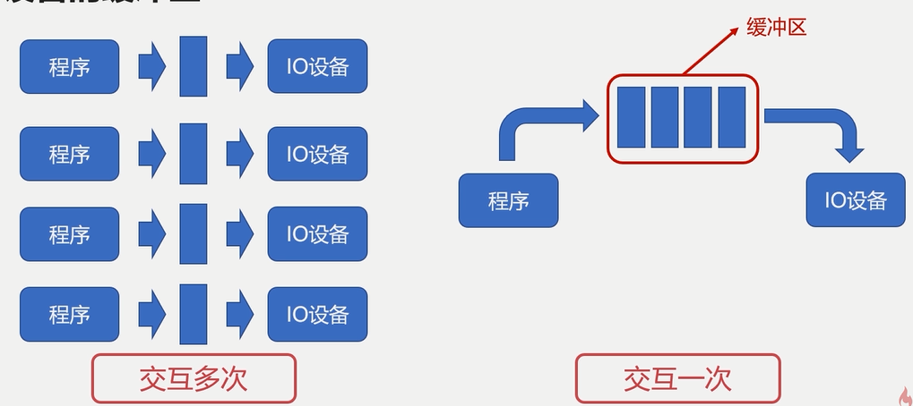

    - IO设备缓冲区是一片可供多个进程使用的公共缓冲区，称为**缓冲池**，使得进程与缓冲池交互，缓冲池再与IO设备交互
  - SPOOLing技术（虚拟设备技术）
    - 是关于慢速字符设备（比如打印机）如何与计算机主机交换信息的一种技术，利用高速共享设备将低速的独享设备模拟为高速的共享设备，逻辑上，系统为每一个用户都分配了一台独立的高速独享设备
    - 进程与一个高速输出队列交互，进程输出到**输出井**中，再单独有一个进程处理输出井与IO设备的交互
    - SPOOLing技术把同步调用低速设备改为异步调用
- 线程同步
  - 互斥量
    - 在一个线程操作临界资源的时候，阻止另一个线程对其进行操作
    - 两个线程的指令交叉执行，互斥量可以保证先后执行
    - 保证关键操作的原子性（指一系列操作不可被中断的特性）
    - 互斥量（互斥锁）通过将变量放在**解锁和加锁**的两态之一，保证资源访问的串行
    ```C
    pthread_mutex_t mutex = PTHREAD_MUTEX_INITIALIZER;
    pthread_mutex_lock(&mutex)
    // operations
    pthread_mutex_unlock(&mutex)
    ```
  - 自旋锁：
    - 使用自旋锁的线程会反复检查锁变量是否可用，自旋锁不会让出CPU，是一种**忙等待状态**，会死循环等待锁被释放
    - 避免了进程或线程上下文切换的开销，不适合单核CPU使用
    ```C
    pthread_spinlock_t spin_lock;
    pthread_spin_lock(&spin_lock);
    // operations
    pthread_spin_unlock(&spin_lock);
    ```
  - 读写锁：
    - 用于临界资源多读少写。
    - 是一种特殊的自旋锁，允许多个读者同时访问资源以提高读性能，但对于写操作是互斥的
    ```C
    pthread_rwlock_t rwlock = PTHREAD_RWLOCK_INITIALIZER; 
    pthread_rwlock_rdlock(&rw_lock);
    // read operation
    pthread_rwlock_unlock(&rw_lock);
    pthread_rwlock_wrlock(&rw_lock);
    // write operation
    pthread_rwlock_unlock(&rw_lock);
    ```
  - 条件变量
    - 允许线程睡眠直到满足某种条件，当满足条件时，可以向该线程发出信号，通知唤醒
    - 需要搭配互斥量使用
    ```C
    pthread_cond_t cond = PTHREAD_COND_INITIALIZER;  // 条件量
    pthread_mutex_t mutex = PTHREAD_MUTEX_INITIALIZER;
    pthread_mutex_lock(&mutex);
    while (condition) {
        pthread_cond_wait(&cond, &mutex); // wait操作，等待下一个notify
    }
    pthread_cond_signal(&cond); // notify操作，wait的操作可以继续执行
    pthread_mutex_unlock(&mutex);
    ```
- 进程同步
  - fork系统调用创建进程，fork创建的进程初始化状态与父进程一样，且系统会为fork的进程分配新的资源
  - fork系统调用无参数，会**返回两次**，分别返回子进程id和0
  - 返回子进程id的是父进程，返回0的是子进程
  - 共享内存：
    - 多进程共同使用物理内存，由于操作系统的进程管理，进程间的内存空间是独立的。默认情况下，进程不能访问进程之外的内存空间。
    - 共享内存允许不相关进程访问同一片物理内存，将同一块物理内存分别映射到不同进程的页表，是两个进程间共享和传递数据最快的方式
    - 未提供同步机制，需要借助其他机制管理访问
    - 使用步骤：
      - 申请共享内存
      - 连接共享内存到进程空间，使得进程可以通过页表访问该内存
      - 使用共享内存
      - 将共享内存脱离进程空间并且删除

    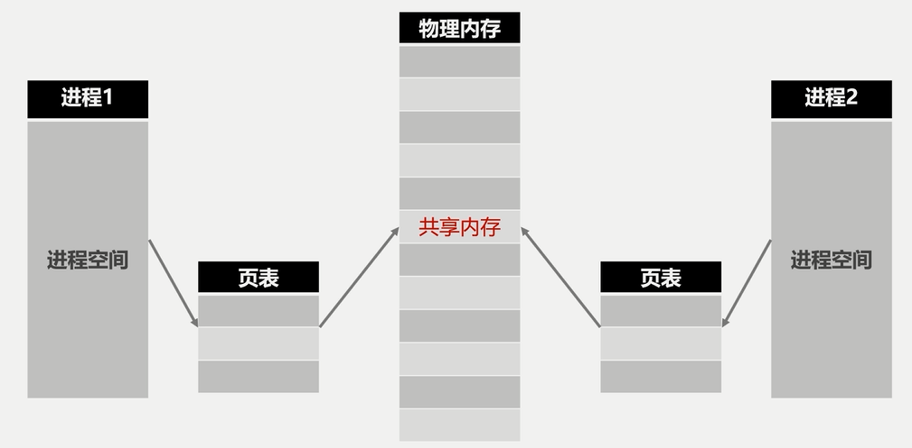

  - Unix域套接字
    - 可以用于同一机器进程间的通信，不需要其他机制来协助多进程访问（共享内存）
    - 使用步骤：
      - server:
        - 创建套接字
        - 绑定套接字
        - 监听套接字
        - 接受&处理信息
      - client
        - 创建套接字
        - 连接套接字
        - 发送信息