# 计算机组成原理（MOOC）
- 计算机的体系与结构
  - 冯诺依曼体系：将程序指令和数据一起存储的计算机设计概念结构：存储程序指令，设计**通用**电路
    - 必须有一个存储器（存储运行的程序以及运行的数据），一个控制器（控制执行哪一个程序，下一个程序是哪个），一个运算器（负责运算），必须有输入设备和输出设备。
    - 现代计算机都是冯诺依曼机
    - 功能：
      - 能够把需要的程序和数据送到计算机中（通过输入设备来实现）
      - 能够长期记忆程序，数据，中间结构以及最终运算结果的能力（存储器）
      - 能够具备算术、逻辑运算和数据传输等数据加工处理的能力（运算器，控制器）
      - 能够按照要求将处理结果输出给用户（IO设备）

      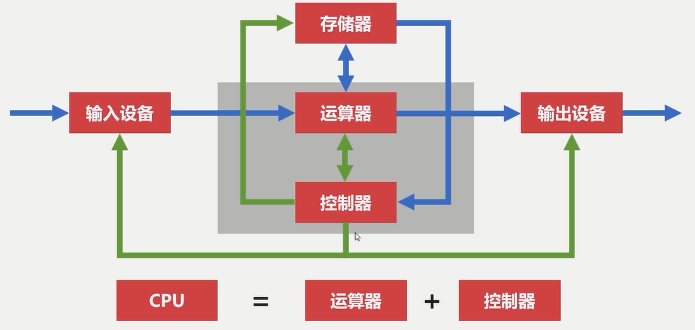

      - 冯诺依曼瓶颈：CPU和存储器速率之间的问题无法调和，CPU经常空转等待数据从存储设备传输

      - 现代计算机结构
        - 解决CPU和存储器之间的性能瓶颈（CPU带存储，包括内存和CPU寄存器）

      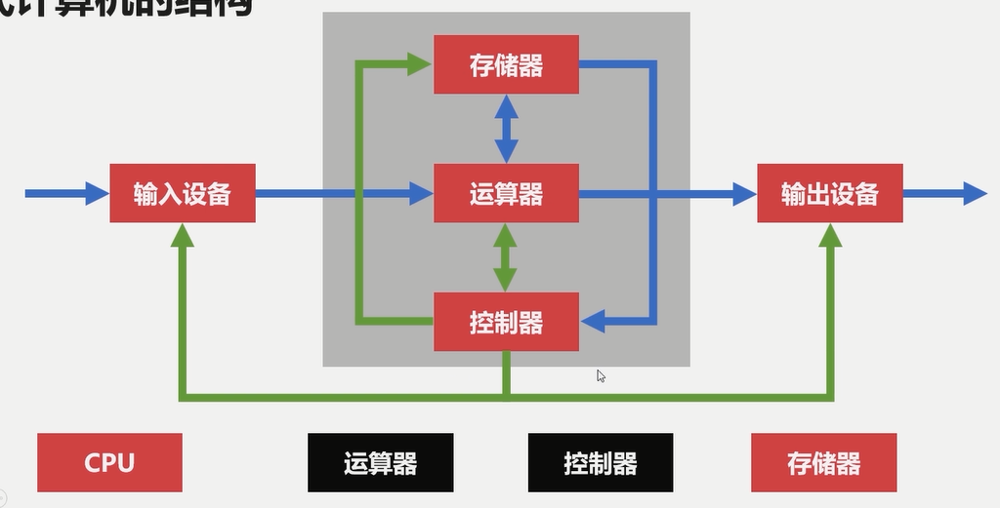

- 计算机的层次与编程语言
  -  程序翻译与程序解析：
    - 程序翻译：较为高级的计算机语言程序由**编译器****生成**较为低级的计算机语言程序
    - 程序解析：较为高级的计算机语言程序作为**解释器**(由低级语言实现)的输入，由解释器将每一语句**转换**成低级语言的程序
    - 比较：
      - 计算机执行的指令都是低级语言
      - 翻译过程生成新的低级语言程序，解释过程不生成新的低级语言程序
      - 解释的过程由低级语言写的解释器去解释高级语言的程序
    - 程序翻译：C/C++, Objective-C, Golang
    - 程序解释：Python, Php, Javascript
    - 程序翻译+解释：Java, C#
      - Java程序编译为JVM字节码，再解释成机器码
  - 计算机的层次与编程语言
    
    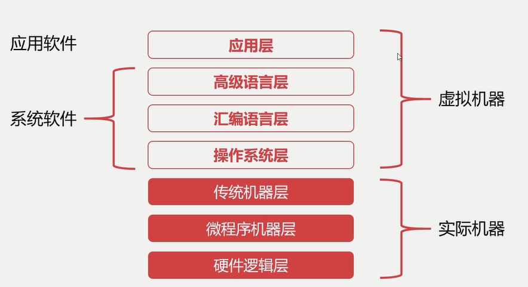

    - 硬件逻辑层：门、触发器等逻辑电路
    - 微程序机器层：编程语言是**微指令集**，**微指令**所组成的**微程序**直接交由硬件执行
    - 传统机器层：编程语言是**CPU指令集（机器指令）**，编程语言和硬件是直接相关，不同架构的CPU使用不同的CPU指令集（一条机器指令对应一个微程序，一个微程序对应一组微指令）
    - 操作系统层：向上提供了简易的操作界面，向下对接了指令系统，管理硬件资源，操作系统层是在软件和硬件之间的适配层
    - 汇编语言层：编程语言是汇编语言，汇编语言可以**翻译**成可直接执行的机器语言，由汇编器完成翻译过程。
    - 高级语言层
    - 应用层：满足计算机针对某种用途而专门设计（APP） 
- 计算机组成原理-组成篇
  - 计算机总线：连接计算机不同部分的数据线，为了解决不同设备之间的通信问题
    - USB总线：通用串行总线
      - 提供了对外连接的接口
      - 不同设备可以通过USB接口进行连接
      - 连接的标准促使外围设备接口统一
    - 分散连接：
        
        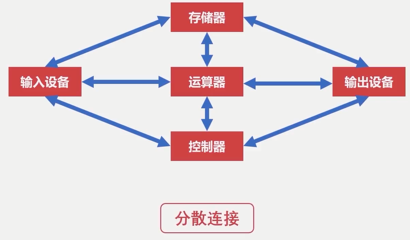
        
    - 总线连接：

        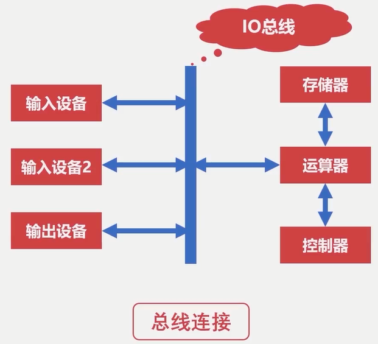
    
    - 分类：
      - 片内总线：**高集成度芯片内部的信息传输线**，存在于寄存器与寄存器之间，寄存器与控制器、运算器之间
      - 系统总线：连接计算机外围各种设备的数据线，负责CPU、主内存、IO设备以及各组件之间的信息传输。分为数据总线，地址总线和控制总线
        - 数据总线：双向传输各个部件的数据信息，数据总线的位数（总线宽度）一般与CPU位数相等（32位、64位）
        - 地址总线：用于指定源数据或目的数据在内存中的地址，位数与存储单元有关。地址总线位数 = n, 则寻址范围 0 ~ 2^n
        - 控制总线：用来发出各种控制信号的传输线，控制信号经由控制总线从一个组件发送给另一个组件，控制总线可以监视不同组件之间的状态（就绪/未就绪）
    - 仲裁：解决设备使用总线使用权时的冲突问题。**仲裁器**可以解决不同设备使用总线优先顺序的设备
      - 方法：
        - 链式查询：连在同一条总线上的设备通过仲裁控制线与仲裁控制器连接，仲裁控制器的控制信号依次到达各个设备，前置设备不占用总线时才会传给后面的设备
          - 好处：电路复杂度低，仲裁方式简单
          - 坏处：优先级低的设备难以获得总线控制权，对电路故障敏感

          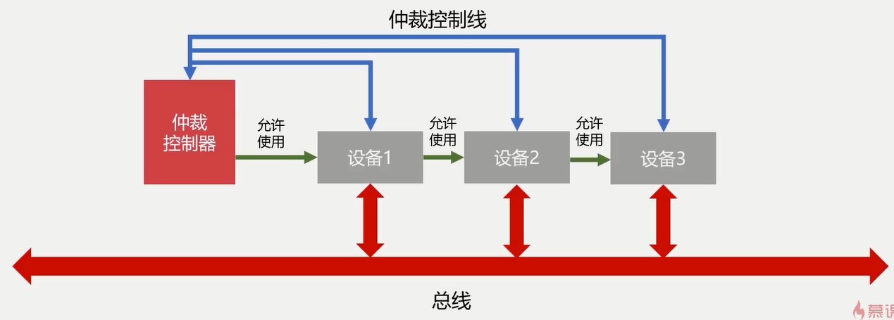

        - 计时器定时查询：
          - 仲裁控制器对设备编号并使用计数器累计计数，接收到仲裁信号后，如果设备不忙，往所有设备发出计数值，计数值与设备编号一致，则获得总线使用权。优先级根据查询方式决定（每次从0开始还是从中止点开始？）

          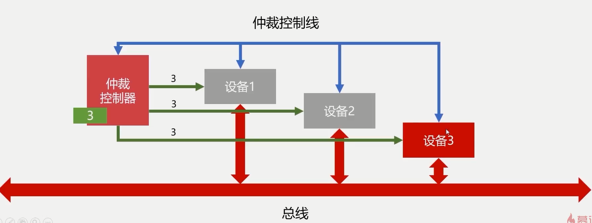
            
        - 独立请求：
          - 每个设备均有总线独立连接仲裁器，设备可单独向仲裁器发送请求和接收请求，当同时收到多个请求信号，仲裁器有权按照优先级分配使用权
            - 好处：响应速度快，优先顺序可动态改变
            - 设备连线多，总线控制复杂

          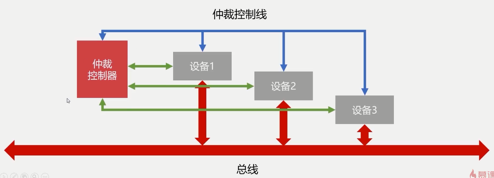
          
  - 输入输出设备：
    - 字符输入设备（键盘），图像输入设备（鼠标，数位板，扫描仪）
    - 图像输出设备：显式器，打印机，投影仪
    - 输入输出接口的设计：
      - 需要向设备发送数据，读取数据，检查设备有没有被占用，检查设备是否已经启动，检查设备是否已经连接
      - 数据线，是IO设备与主机之间进行数据交换的传输线，分单向双向
      - 状态线，IO设备状态向主机报告的信号线，可以查询设备是否已经正常连接并就绪，以及设备是否已经被占用
      - 命令线，CPU向设备发送命令的信号线（读写，启动停止）
      - 设备选择线，主机选择IO设备进行操作的信号线，对连在总线上的设备进行选择
    - CPU与IO设备的通信：（前提：CPU速度与IO设备速度不一致
      - 程序中断：提供低速设备通知CPU的一种异步的方式，CPU可以高速运转同时兼顾低速设备的响应
        - 当外围IO设备就绪时，向CPU发出中断信号，CPU有专门的电路响应中断信号

          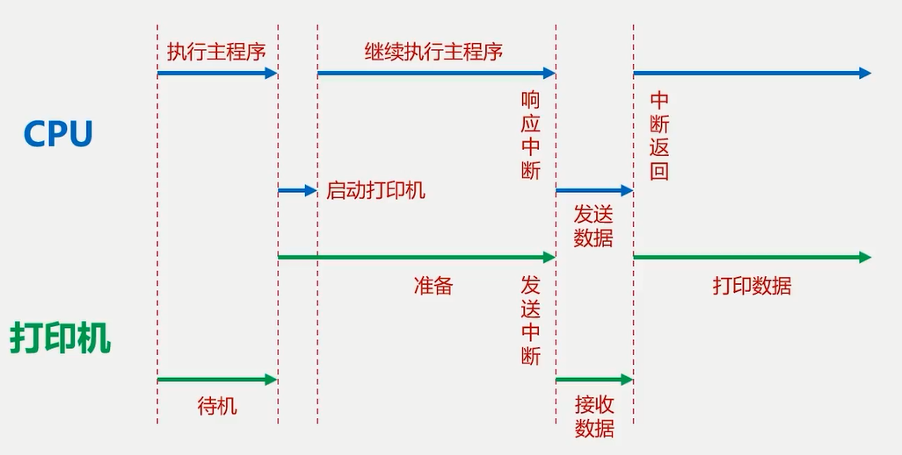

      - DMA（直接存储器访问, Direct Memory Access）：
        - DMA直接连接主存与IO设备
        - DMA工作时不需要CPU的参与
        - 当主存与IO设备交换信息时，不需要中断CPU，以提高CPU效率
        - 存在于硬盘，外置显卡中

        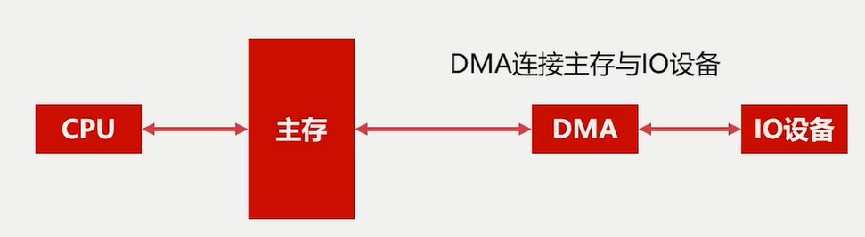
  
  - 计算机存储器：
    - 分类：
      - 按存储介质：半导体存储器（内存，U盘，固态硬盘），磁存储器（磁带，磁盘）
      - 按存取方式：随机存储器（RAM，随机读取，与位置无关），串行存储器（与位置有关，按顺序查找），只读存储器（ROM，只读不写）
    - 层次结构：
      - 缓存：（CPU寄存器，高速缓存）速度快，位价高
      - 主存：（内存）速度适中，位价适中
      - 辅存：外部存储设备（U盘，磁盘）
      - 缓存-主存层次：（CPU不参与）
        - 原理：局部性原理：当CPU访问存储器时，无论是**存取指令**还是**存取数据**，所访问的存储单元都趋于**集中在一个较小的连续区域中**，故可采用一定策略将程序常访问的内存块置换到缓存中。
        - 实现：在CPU与主存之间增加一层速度快，容量小的Cache。
        - 目的：**解决主存速度不足的问题**
        
        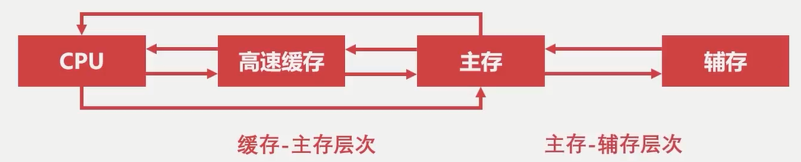
      
      - 主存-辅存层次：
        - 原理：局部性原理
        - 实现：主存之外增加辅助存储器（磁盘，SD卡，U盘等），将使用中的数据加载到主存中，尚未使用的数据仍然位于辅存中。
        - 目的：**解决主存容量不足的问题**
  - 主存储器-内存：
    - 是RAM，通过电容存储数据，必须隔一段时间刷新一次数据，如果掉电，一段时间后将丢失所有数据。
      - CPU中的主存数据寄存器（MDR, Memory Data Register）通过**数据总线**与**读写电路**相连
      - CPU中主存地址寄存器（MAR, Memory Address Register）通过**地址总线**与内存连接
      - CPU通过地址总线指定数据的位置，通过数据总线来传输相关的数据
      - 32位系统只支持 4GB 内存，再多也没有用，因为它的地址总线只有32位，而64位系统支持的内存比较大 2^(x + 30)=32/64, 30为GB

    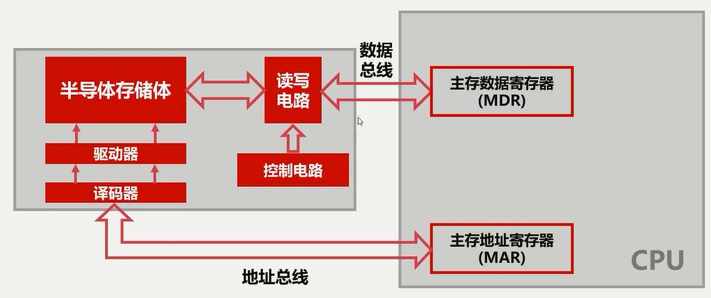

  - 辅助存储器-磁盘：
    - 状态描述：磁盘一圈为一个磁道，磁道的一段为一个扇区，需要磁头位置以及方向
    - 调度算法：（假设磁盘有5个磁道，磁头目前在磁道4，磁头方向向外，需要读取1->4->2->3->1->5）
      - 先来先服务算法：
        - 按照顺序访问进程的磁道读写需求
        - 读取顺序：4->1->4->2->3->1->5
      - 最短寻到时间优先：
        - 优先访问离磁头最近的磁道
        - 读取顺序：4->4->5->3->2->1->1
      - 扫描算法（电梯算法）：
        - 每次只往一个方向移动，到达一个方向需要服务的尽头再反向移动
        - 读取顺序：4->4->3->2->1->1->5
      - 循环扫描算法：
        - 读取时只有一个方向
        - 读取顺序（假设只由外（小）往内（大）读取）：4->4->5->1->1->2->3

  - 高速缓存：
    - 字：指存放在存储单元中的二进制代码组合，是主存的基本存储单元
    - 字块：存储在**连续的存储单元**中而被看作时一个单元的一组字

    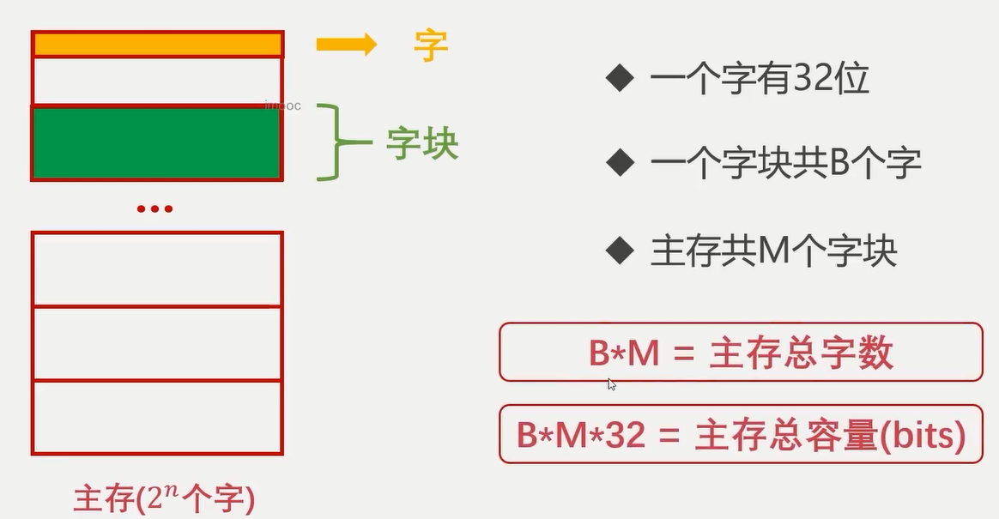
    
    - 字的地址包含：前m位指定字块的地址，后b位指定字在字块中的地址，故 2^m = M, 2^b = B
    - 缓存存储结构与主存类似，但字块数远小于主存（容量小），且存储的数据为主存中数据的一个复制，来自于主存，且速度更快
      - 字的地址包含前c位指定字块地址，后b位指定字在字块中的地址。
      - 高速缓存性能由命中率衡量，是CPU每次取数据，从高速缓存中取数据的概率
      - 访问效率衡量在高速缓存中取数据的时间占总的取数据时间的比率，定义为 tc/ta, tc为访问缓存的时间，ta为访问主存系统的平均时间
    - 高速缓存的替换策略
      - 替换时机：当CPU所需的数据不在高速缓存里的时候，需要从主存载入所需数据到高速缓存
      - 随机算法
      - FIFO算法
      - LFU算法
      - LRU算法
  - 计算机指令系统：
    - 由操作码和地址码组成，操作码在前，地址码在后，操作码指明指令要完成的操作，操作码的位数反映了机器的操作种类，地址码直接给出操作数或者操作数的地址，分为三地址指令、二地址指令和一地址指令，标识地址码指定了几个地址
    ```
    OP addr1 addr2 addr3
    三地址：(addr1) OP (addr2) -> (addr3)
    二地址：(addr1) OP (addr2) -> (addr1)或(addr2)
    一地址：(addr1) OP -> (addr1)，或者 (addr1) OP (ACC) -> (addr1) (默认行为，比如自增)
    零地址：在机器指令中无地址码，空操作，停机操作，中断返回操作等
    ```
    - 类型：
      - 数据传输：寄存器之间、寄存器与存储单元、存储单元之间传送，数据读写、交换地址数据、清零置一等操作
      - 算术逻辑操作：加减乘除，与或非
      - 移位操作：数据左右移
      - 控制指令：等待，停机，空操作，中断等
    - 寻址方式：
      - 指令寻址：分为顺序寻址和跳跃寻址，一般为顺序寻址，有特定指令（JMP），改为跳跃寻址
      
      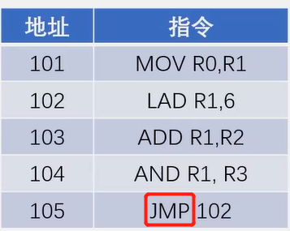
      
      - 数据寻址：分为立即寻址，直接寻址和间接寻址。
        - 立即寻址：指令直接可以获得操作数，无需访问存储器
        ```
        OP addr1 6(这里6是直接放在机器指令里面的)
        ```
        - 直接寻址：直接给出操作数在主存中的地址，寻找操作数简单，无需计算数据地址
        - 间接寻址：指令地址码是操作数地址的地址，类似于指针，需要访问一次或多次主存来获取操作数

        
  
  - 控制器构成
    - 协调和控制计算机运行
    - 程序计数器：
      - 用来存储下一条指令地址，循环从程序计数器中拿出指令，当指令被拿出时，指向下一条指令
    - 时序发生器：
      - 发送时序脉冲（时钟）
    - 指令译码器：
      - 将操作码翻译成对应的操作，以及控制传输地址码对应的数据
    - 寄存器
      - 指令寄存器
        - 缓存从主存或高速缓存中取得的计算机指令
      - 主存地址寄存器
        - 保存当前CPU正要访问的内存单元的地址
      - 主存数据寄存器
        - 保存当前CPU正要读或写的主存数据
      - 通用寄存器
        - 用于暂时存放或传送数据或指令
        - 可保存ALU的运算中间结果
        - 容量比一般专用的寄存器要大
    - 总线
  - 运算器构成：
    - 运算器是用来进行数据运算加工的
    - 数据缓冲器：
      - 分为输入缓冲和输出缓冲，输入缓冲暂时存放外设送过来的数据，输出缓存暂时存放送往外设的数据
    - ALU（Arithmetic & Logical Unit，算数逻辑单元）
      - 进行常见的位运算和算数运算
      - A, B作为输入，F作为输出，K是一些控制线，控制ALU中的运算

      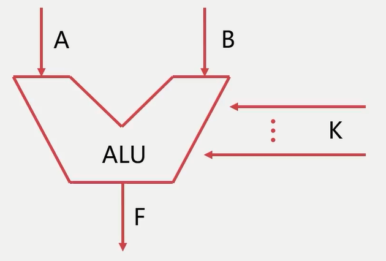

    - 状态字寄存器：
      - 存放运算状态（条件码，进位，溢出，结果正负等）
      - 存放运算控制信息（调试跟踪标记位、允许中断位等）
    - 通用寄存器：
      - 用于暂时存放或传输数据或指令
      - 可保存ALU的运算中间结果
    - 总线
  - 计算机指令的执行过程：
    - 指令执行过程：
      - 首先将数据和指令缓存在数据缓存和指令缓存中
      - 取指令  
        - 程序计数器从缓存载入指令的地址
        - 指令寄存器通过片内总线读取并缓存程序计数器给定的命令，包括操作码和地址码
      - 分析指令
        - 将指令寄存器得到的指令发送到指令译码器中。
        - 指令译码器将控制信号通过片内总线传递到运算器中。
        - 程序计数器+1，移向下一条要执行的指令
        - 运算器拿到控制信号后，执行操作
      - 执行指令
        - 根据指令不同有区别
          - 装载数据到寄存器
          - ALU处理数据
          - 记录运算状态
          - 送出运算结果
          - MOV R0, R1为例: 
            - R0加载到ALU
            - ALU将R0送出到数据缓存器
            - 数据缓存器将R0覆盖到R1上，完成操作
      - 此过程中CPU综合利用率并不高

        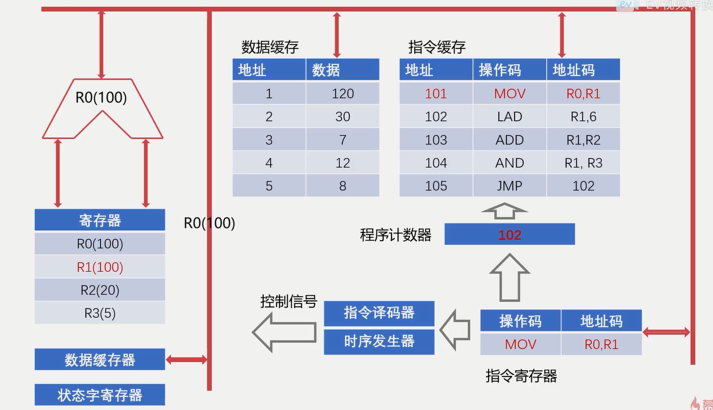

    - CPU流水线设计：
      - 类似工厂的装配线，以提高CPU利用效率

      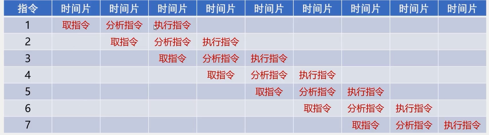

- 计算机组成原理-计算篇
  - 原码表示法：符号位在最左边，0为正，1为负
    - 运算复杂，而且0有两种表示，歧义
  - 补码表示法：
    - 解决0的歧义，简化不同符号数的操作
    - 补码：0或正数为 x （自身） ，负数为2^(n+1) + x ，这里 n 为规定的原数据大小，比如 n = 4, -7 -> 1,0111 (原码), -7的补码: 100000 - 0111 = 11001, 此时1仍然为符号位。13的原码和补码一样，都为 01101
    - 计算方法：
      - 整数：正数为自己，负数为将符号位以外的比特取反再加1
      - 小数：符号位之后比特取反再加1，包括整数部分
  - 定点数：
    - 小数点固定在某个位置的数
    - 纯小数：小数点在符号位和数值位之间
    - 纯整数：小数点在整个数值的末尾
    - 带小数的整数：乘以比例因子以满足定点数的保存格式
    - 一般只用来保存纯小数或纯整数
  - 浮点数：
    - 表达带小数的整数，且范围更大，精度更高，运算更复杂，溢出处理和编程方面优于定点数，但运算规则，运算速度和硬件成本方面不如定点数
    - 表示格式：N = S x r^j, S表示尾数，r表示阶数，j表示阶码
    - 阶码符号位 | 阶码数值位 | 尾数符号位 | 尾数数值位
    - 尾数规定使用纯小数
      - 11.0101 = 0.110101 x 2^10
      - 0 | 10 | 0 | 11010100 (8位)
      - 11.0101 = 0.0110101 x 2^11
      - 0 | 11 | 0 | 01101010 (8位) (不规范)
    - 表示范围
      - 阶码：设有 m 位：[-(2^m - 1), 2^m - 1]
      - 尾数：设有 n 位：[-(1 - 2^-n), -(2^-n)] U [2^-n, 1-2^-n]
      
      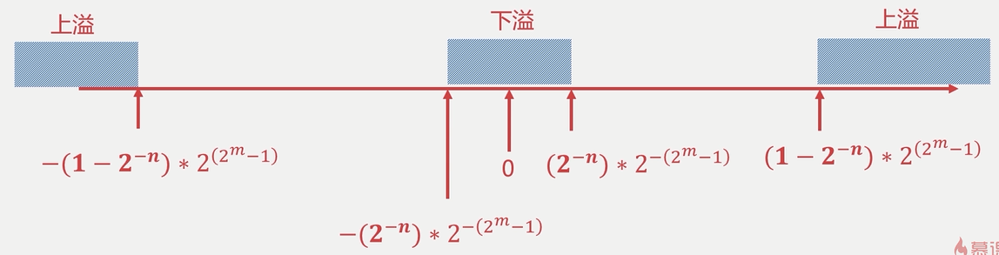
    
    - 单精度：4字节、32位表达浮点数
    - 双精度：8字节、64位表达浮点数
    - 规格化：
      - 要求尾数必须使用纯小数，且**尾数最高位必须位1**
      - 设浮点数字长为16位，阶码为5位，尾数11位，表示(13/128): x = 0.1101000 * 2^-11 -> 1 | 0011 | 0 | 1101000000

      - 表示 -54： x = -0.110110 * 2^110 -> 0 | 0110 | 1 | 0010100000 (尾数: 1101100000, 反码: 0010011111, 补码: 0010100000)
  - 定点数加减法：
    - 整数加法：A[补] + B[补] = [A + B][补](mod 2^(n+1))
    - 小数加法：A[补] + B[补] = [A + B][补](mod 2)
    - 数值位与符号位一同运算，并将符号位产生的进位自然丢掉(取模操作)，会产生溢出，两个同符号数相加产生异符号数
    - 判断溢出：
      - 双符号位判断法：单符号位表示变成双符号位：0 => 00, 1 => 11, 双符号位产生的进位丢弃，结果的双符号位不同则表示溢出
        - A = -10010000, B = -11010000
        - A[补] = **11**,01110000
        - B[补] = **11**,00110000
        - A[补]+B[补] = (A + B)[补] = **10**,10100000 
    - 整数减法：A[补] - B[补] = [A + (-B)][补](mod 2^(n+1))
    - 小数减法：A[补] - B[补] = [A + (-B)][补](mod 2)
    - -B[补] = B[补] 连同符号位按位取反，末位加1
      - B[补] 1,0010101
      - (-B)[补] = 0,1101011
  - 浮点数加减法：
  
  
  
    - 对阶：使两浮点数阶码一致，使得尾数可以进行运算
      - 按小阶看齐大阶的原则：
    - 尾数求和：使用补码进行运算，减法转换为加法运算
    - 尾数规格化：对补码进行规格化需要判断：S > 0 和 S < 0
      - S[补] = 00.1xxxxxxx (S > 0)
      - S[补] = 11.0xxxxxxx (S < 0)
      - 如果不满足此格式（符号位与最高位不一致），一般需要进行左移，同时阶码相应变化，以满足规格化，但双符号位不一致的时候需要右移，此情况在双浮点数不算溢出，右移的话需要舍入操作
       - 0舍1入：S[补] = 10,10110111  --右移-->  S[补] = 11,01011011(1)  -- +1 (因为舍去的是1) --> 11,01011100，如果有阶码，阶码要 +1，可能会溢出
        - 设 x = 0.1101 x 2^01, y = (-0.1010) x 2^11
        - x : 00 | 0001 | 00 | 1101
        - y : 00 | 0011 | 11 | 1010
        - x : 00 | 0011 | 00 | 0011(01) (对阶)
        - y : 00 | 0011 | 11 | 1010     (对阶)
        - sum : 00 | 0011 | 11 | 1001   (尾数求和，尾数不规范)
        - sum : 00 | 0010 | 11 | (1)0010 (尾数规格化)
    - 溢出判断：
      - 通过阶码的双符号位判断，如果规格化后，阶码双符号位不一致，则认为是溢出
    - 数值位左右移补零，符号位左右移补对应符号（限于双符号位）
    - 乘法：阶码相加，尾数求积
    - 除法：阶码相减，尾数求商


# 习题
  ## 概述篇
  1. 计算机的发展历史大概可以分为几个阶段？每个阶段的计算机分别有什么特点？
  1. 你了解“摩尔定律”吗？“摩尔定律”对现代计算机产生了什么影响？
  1. 你了解冯诺依曼机吗？你是否可以大概描述冯诺依曼机的基本组成和工作原理？冯诺依曼机相对于之前的计算机有什么重要改进？
  1. 什么是冯诺依曼瓶颈？冯诺依曼瓶颈对现代计算机产生了什么影响？
  1. 你了解程序解释和程序翻译吗？什么是编译型语言，什么是解释型语言呢？
  1. 请你列举十种以上的编程语言，并分别分类他们属于什么类型的语言。
  1. 你了解计算机的层次结构吗？今天的软件和硬件是怎么界定的。
  1. 请你尝试说明高级语言、汇编语言和机器语言的区别和联系？
  1. 请完成常见的容量换算公式：
  
      1). 1G = ( )Bytes
  
      2). 1Byte = ( )bits
  
      3). 一条内存条的容量大约2( )
  
      4). 一个磁盘的容量大约1( )
  
      5). 一个SSD的容量大约256( )
  
  1. CPU的速度一般使用什么做单位？它具有什么物理意义？
  1. 网络的速度一般使用什么做单位？
  1. 20世纪80年代以前的计算机是不支持输入中文的，当时的计算机使用的是什么编码集？
  1. ASCII编码集占用多少个字节？
  1. ‘A’, ‘b’, 'C’对应的ASCII十进制数值分别是多少？
  1. 你可以使用你熟悉的语言将 72、96、108转换为ASCII码吗？
  1. 你知道Unicode编码和UTF-8编码的区别和联系吗？
  1. 假设有10000个汉字，6000个日本字，3000个韩国字，1000个特殊字符，如果让你设计一套通用的编码集，请问每个字至少几个比特位？
  
  概念：
  
  - 摩尔定律
  - 冯诺依曼机
  - 冯诺依曼瓶颈
  - 程序解释
  - 程序翻译
  - 高级语言
  - 汇编语言
  - 机器语言
  - 计算机软件
  - 计算机硬件
  - 计算机的层次结构
  - 计算机编码集

  ## 组成篇
  1. 计算机的总线就像是计算机的“高速公路”，你是否可以说出总线主要的功能和分类？
  1. 什么是总线标准，为什么需要总线标准，现在有哪些常见的总线标准？
  1. 常说的“IO设备”，“I”、“O”分别是什么的缩写？
  1. 常见的输入设备可以分为什么种类？
  1. 常见的输出设备可以分为什么种类？
  1. 日常常见的计算机外设（显示器、键盘、鼠标、打印机），分别属于什么设备？
  1. 输入输出接口一般需要完成什么工作，可以把接口的线路分为什么线路？
  1. DMA的全称是什么？
  1. 程序中断和DMA相比，有什么优劣？
  1. 你是否可以清晰的表述计算机存储器的层次结构？存储器的层次结构是为了解决什么问题的？
  1. 什么是局部性原理，局部性原理对计算机存储系统的设计产生了什么影响？
  1. 计算机存储系统的每一个层次分别有什么特点？
  1. 计算机的辅助存储器一般是指计算机硬盘，你了解计算机磁盘的物理结构吗？
  1. 磁盘的调度算法有哪些？分别有什么特点？
  1. 计算机的主存一般是指计算机内存，内存有什么特点？
  1. 请解释概念：主存、辅存、Cache、RAM、ROM？
  1. 什么是字？什么是字块？
  1. 计算机的高速缓存一般是指Cache，Cache一般位于计算机的什么硬件设备上？
  1. 一般使用什么指标去评估主存-高速缓存的性能？
  1. 命中率是怎么定义的？
  1. 访问效率是怎么定义的？
  1. 假设CPU执行某段程序共计访问Cache命中4800次，访问主存200次，已知Cache的存取周期是30ns，主存的存取周期是150ns，求Cache-主存系统的平均访问时间和效率，试问该系统的性能提高了多少？
  1. 请描述LFU、LRU、FIFO缓存置换算法的过程。
  1. 计算机的指令一般由操作码和地址码组成，那么计算机指令可以分类为几种类型？
  1. 对计算机指令数据的寻址有哪几种方式？
  1. 计算机的运算器主要由什么组成？控制器呢？
  1. 请简述计算机指令的执行过程。
  ## 计算篇
  1. 除了十进制以外，这个世界上常见的还有什么进制？
  1. 二进制一般使用什么方法转换成十进制？
  1. 十进制一般使用什么方法转换成二进制？
  1. 计算机直接使用原码计算有什么缺点？
  1. 请计算12、124、1023、-1、-127的二进制原码。
  1. 计算机的补码解决了什么问题？
  1. 请计算12、124、1023、-1、-127的补码，并将其使用32位定点表示法和32位浮点表示法(1位符号位、8位阶码、23位数值位)表示出来。
  1. 你是否可以使用代码实现一个通用的计算器，可以将二进制数转换为十进制数，把十进制数转换为二进制数。
  1. 计算机为了判断运算溢出使用了什么方法？
  1. 什么是溢出？什么是上溢？什么是下溢？
  1. 对于64位浮点型(double)，一般都是采用最高位为符号位，次高11位为指数位，其次52位为尾数，试求出double型所能表达的最大值和最小值。
  1. 浮点数相比定点数，有什么优势？有什么不足的地方。
  1. 浮点数之间做加减法运算需要几个步骤？每个步骤都是必须的吗？为什么？
  1. x=0.1101^1001, y=0.1011^110，请计算x+y的值，x-y的值。
  1. x=0.1101^111, y=-0.1111^1101，请计算x+y的值，x-y的值。

# 答案
  ## 概述篇
  1. 四个阶段：电子管计算机、晶体管计算机、集成电路计算机、超大规模集成电路计算机。
  1. 摩尔定律：摩尔定律是由英特尔（Intel）创始人之一戈登·摩尔（Gordon Moore）提出来的。其内容为：当价格不变时，集成电路上可容纳的元器件的数目，约每隔18-24个月便会增加一倍，性能也将提升一倍。换言之，每一美元所能买到的电脑性能，将每隔18-24个月翻一倍以上。这一定律揭示了信息技术进步的速度。尽管这种趋势已经持续了超过半个世纪，摩尔定律仍应该被认为是观测或推测，而不是一个物理或自然法。
  1. 冯诺依曼机有五大组成部分：输入设备、输出设备、运算器、存储器、控制器。冯诺依曼机把程序指令和运行数据存储起来，使得计算机从专用电路计算机发展成为通用电路计算机。
  1. 冯诺依曼瓶颈指的是存储器和运算器之间的访问速率差异巨大，使得计算机性能无法提升。现代计算机以存储器为核心，根据局部性原理设计了存储器的层次结构，大幅提升计算机性能。
  1. 编程语言可以分为解释型语言和编译型语言，程序解释指的是程序代码在运行时，逐行翻译成较低层次的编程语言去执行；程序翻译指的是程序代码在编译阶段提前翻译成较低层次的编程语言逻辑，在运行时直接运行。
  1. 编译型语言：C、C++、Go、OC，解释型语言：Php、Python、Javascript、Perl、Lua，翻译+解释型语言：Java、C#、Kotlin等。
  1. 计算机的层次结构划分是为了方便理解计算机的整一个体系，在不同书籍或领域会有不一样的划分，没有绝对的正确。今天的软件、硬件的划分以硬件电路为界限，从涉及硬件电路逻辑往下的都归为硬件，要注意软件和硬件的划分也是与时俱进的，今天的软件很可能明天就变成了硬件，比如以前编写硬件逻辑代码是软件，而随着高级编程语言的出现和成熟，现在编写硬件逻辑代码已经视为硬件部分了。
  1. 高级语言是方便程序员描述程序逻辑的编程语言，与人类语言接近；汇编语言时方便程序员描述硬件逻辑的编程语言，与底层硬件接近；机器语言时方便计算机理解和运行的编程语言，一般程序员无法理解。
  1. 1024^3、8、GB、TB、GB。
  1. 赫兹，是国际单位制中频率的单位，它是每秒中的周期性变动重复次数的计量。1Hz = 1/s，即在单位时间内完成振动的次数，单位为赫兹（1赫兹=1次/秒）。
  1. bps，比特率是指每秒传送的比特(bit)数。单位为 bps(Bit Per Second)，比特率越高，每秒传送数据就越多。
  1. ASCII编码集。
  1. ASCII有128个字符，占用7个比特位，扩展ASCII编码机占用8个比特位，一个字节。
  1. 65、98、67。
  1. Python使用chr函数就可以将十进制数转换为ASCII码对应字符。
    
    >>> chr(72)
    'H'
    >>> chr(96)
    '`'
    >>> chr(108)
    'l'

  16. Unicode全名为：统一码、万国码，是计算机科学领域里的一项业界标准。Unicode标准有不同的编码实现，比如UTF-8、UTF-16、UTF-32，也即是可以有多种规则来实现Unicode标准，比如UTF-8使用的是不定长字节表示Unicode字符，在表示高位Unicode字符时可以自动扩展，UTF-32使用的是定长4个字节表示Unicode字符。
  16. 10000+6000+3000+1000=20000个字符，最起码使用15个比特位，占2个字节。
  ## 组成篇
  1. 总线可以分为：片内总线、系统总线，其中系统总线可以分为数据总线、地址总线、控制总线。
  1. 总线标准是系统与各模块、模块与模块之间的一个互连的标准界面。总线标准有利于各模块高效使用总线。USB、PCIe等。
  1. Input、Output，输入设备、输出设备。
  1. 字符输入设备（键盘等）、图像输入设备（鼠标、数位板、扫描仪）。
  1. 主要是图像输出设备（显示器），但在计算机远未普及的时候，显示器属于字符输出设备。
  1. 显示器、打印机属于输出设备，键盘、鼠标属于输入设备。
  1. 数据线、状态线、命令线、地址线。
  1. DMA：Direct Memory Access，直接内存存取。
  1. 程序中断和DMA都是计算机IO和低速设备的交互方式，程序中断方式实现简单，DMA方式效率更高。
  1. 存储器的层次结构可以简单划分为：缓存-主存-辅存三个层次，缓存-主存主要是为了解决主存速度不够的问题；主存-辅存主要是为了解决主存容量不足的问题。
  1. 局部性原理是指CPU访问存储器时，无论是存取指令还是存取数据，所访问的存储单元都趋于聚集在一个较小的连续区域中。
  1. 缓存：速度快、位价高；主存：速度适中、位价适中；辅存：速度慢、位价低。
  1. 略，参考PPT图片。
  1. 先来先服务算法、最短寻道时间优先算法、扫描算法、循环扫描算法。
  1. 主存容量比缓存大、比辅存小，访问速度比缓存慢，比辅存快，主存需要持续通电使用，停电时主存数据将会丢失。
  1. 主存：主存储器，即常说的计算机内存条，辅存：辅助存储器，即常说的磁盘、U盘、光盘、磁带等，Cache：高速缓存，即常说的L1、L2、L3缓存，CPU寄存器等，RAM：随机存取存储器（英语：Random   1. Access Memory，缩写：RAM），ROM：只读存储器（Read Only Memory，缩写：ROM）。
  1. 字是指存放在一个存储单元中的二进制代码组合；字块是指存储在连续的存储单元中而被看作是一个单元的一组字。
  1. 在CPU上。
  1. 命中率。
  1. PPT
  1. PPT
  1. 平均访问时间：(480030+150200)/5000=34.8ns，命中率：4800/5000100%=96%，访问效率e：30/34.8100%=86.2%，性能提升：(150-34.8)/150*100%=76.8%。
  1. 略。
  1. 移位操作指令、数据传输指令、控制指令、算术逻辑操作指令。
  1. 立即寻址、直接寻址、间接寻址。
  1. 控制器主要由：程序计数器、时序发生器、指令译码器、寄存器、总线组成。运算器主要由：数据缓冲器、ALU、寄存器、状态字寄存器、总线组成。
  1. 略。
  ## 计算篇
  1. 二进制、八进制、十二进制、二十进制、六十进制。
  1. 整数：按权展开法。
  1. 整数：重复相除法，小数：重复相乘法。
  1. 0有两种表示方法，减法运算复杂。
  1. 12(0,00001100)、124(0,01111100)、1023(0,1111111111)、-1(1,00000001)、-127(1,01111111)。
  1. 相比原码的运算过程（特别是减法），补码对于计算机而言运算更加简单。
  1. 略。
  1. 略。
  1. 双符号位判断法。当双符号位不一致表示溢出。
  1. 溢出即计算机无法表示数值。上溢是指数值绝对值大于表示范围，下溢是指计算机无法提供有效精度表示数值。
  1. 略。
  1. 浮点数可以表示更大的数据范围，但是运算耗时更长。
  1. 浮点数加减法需要经过以下几个步骤：对阶、尾数求和、尾数规格化、舍入、溢出判断。对阶是为了使得尾数可以进行运算，阶码不一致尾数运算无效，尾数规格化、舍入是为了正确存储结果，溢出判断是为了判断运算过程是否有误，如果溢出将会发出信号进行溢出处理。
  1. x+y=0.1110011^1001，x-y=0.1011101^1001。
  1. x+y=-0.1110110011^1101，x-y=0.1111001101^1101。