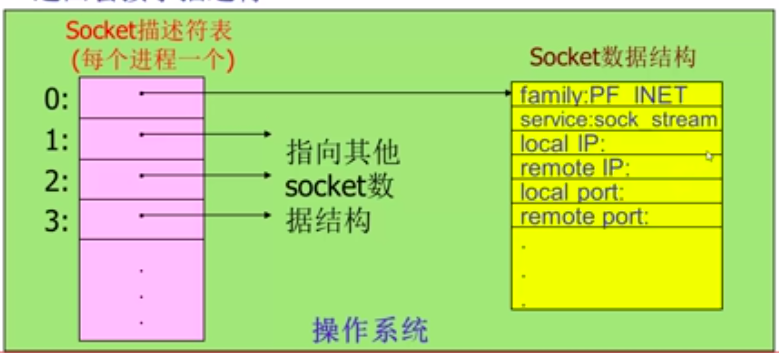
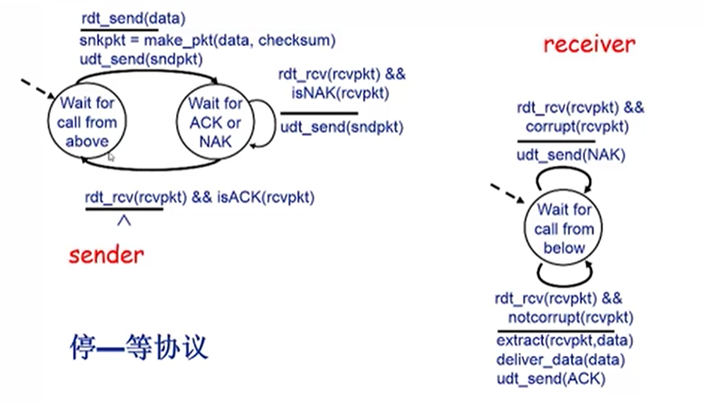

- 计算机网络定义：互联的、自治的计算机集合
  - 自治：无主从关系
  - 互联：互联互通
- 主机与交换网络相连。交换网络里面有交换节点（路由器或交换机）
- 什么是Internet？
  - 全球最大的**互联网络**
    - 通过ISP（Internet Service Provider）联系在一起，是网络之网络，分全球ISP，区域ISP。
    - Internet是数以百万级的互连计算设备集合。
    - 分组交换方式相连
  - 为网络应用提供通信服务的通信基础设施
  - 为网络应提供编程接口
  - 需要**设备**和**协议**同时作用，达到顺利链接的目的
- **协议**是数据交换中事先约定好的规则，规定了通信实体之间交换信息的**格式**，**意义**，**顺序**以及针对收到信息或发生的事件所采取的**动作**
  - 三要素：
    - 语法
      - 数据与控制信息的结构或格式
      - 信号电平
    - 语义
      - 需要发出何种控制信息
      - 完成和中动作以及何种响应
      - 差错控制
    - 时序
      - 事件顺序
      - 速度匹配
- 计算机网络结构
  - 网络边缘
    - 主机（端系统）
      - 客户/服务器应用模型
        - 客户发送请求，接收服务器响应
      - 对等（peer-peer, P2P）应用模型：
        - 无（或不仅依赖）专用服务器
        - 通信在对等实体之间直接进行
    - 网络应用
  - 接入网络，物理介质
    - 有线或无线通信链路
      - 如何将网络边缘接入核心网
        - 典型模型：
          - 数字用户模型(DSL): 频分多路复用，(ADSL：非对称模型，上行下行速率不一样)
            - 利用已有的电话线接入
            - 独占
          - 电缆网络：
            - 频分多路复用：在不同频带传输不同信号
            - HFC：混合光纤同轴电缆，不同于DSL的独占至中心局的接入。
          - 机构接入网络
          - 无线接入网络：通过**基站**或称为**接入点**
            - LANs无线局域网
            - 广域无线接入（蜂窝网）
  - 网络核心（核心网络）
    - 关键功能：路由+转发
      - 路由：确定分组从源到目的传输路径
      - 转发：将分组从路由器的输入端口交换至正确的输出端口
    - 数据交换技术
      - 动态转接：端口到端口
      - 动态分配传输资源
      - 类型：
        - 电路交换
          - 最典型的交换网络：电话网络
          - 三个阶段：
            - 建立连接
            - 通信
            - 释放连接
          - 主要特点：**资源独占**：通信资源独占，而不是电路资源
          - 中继线共享：多路复用技术
            - 每路呼叫独占分配到的资源片进行通信
            - 分为：频分(FDM)，时分(TDM)，波分(WDM)，码分(CDM)
              - 频分：信号调制到不同的频带上。在用户分配了频带后，通信期间不变
              - 时分：将时间划分为一段段等长的**时分复用帧**，每个用户在每个TDM帧中占用固定序号的**时隙**
              - 波分：光通信中的频分复用
              - 码分：广泛用于无线通信（蜂窝网，卫星通信等）
                - 每个用户分配唯一的 m bit 码片序列，各用户使用相同的频率载波，利用各自码片序列编码数据
                - 编码信号=(原始数据)x(码片序列)  ---原始数据 = -1(0) / 1(1), 码片序列会比较长，对每个用户固定， 一个原始数据作用在一段码片上
                - 各用户的码片序列必须正交，所以才会提取出对应用户的信息
                - 信道传输的是各用户的叠加向量
        - 报文交换
          - 报文：源（应用）发送信息整体
          - 交换机收到整个报文后，再决定转发给谁
        - 分组交换
          - 分组：把报文进行拆分成一系列小数据包
          - 会给数据装上数据头，数据头+数据=分组
          - 需要报文的拆分与分组，会产生额外开销
          - 源主机向交换机发送分组的时候，交换机也会向目的主机发送已经接受到的分组
          - **统计多路复用**：分组序列不确定，按需共享链路
        - 报文交换与分组交换均采用存储-转发的交换方式
          - 报文交换以完整的报文进行存储-转发 (路由器所需缓存较大, 时间较长，串行)
          - 分组交换用较小的分组进行存储-转发 (路由器所需缓存较小，时间较短，并行)，报文交付时间（报文：Mbits, 链路带宽：Rbps, 分组大小：Lbits, 跳步数：h, 路由器数：n）：T = M/R + (h - 1) L/R = M/R + nL/R
      - 分组交换适用于突发数据传输网络
      - 可能产生拥塞：分组延迟和丢失
    - 互联的路由器（或分组转发设备）
    - 网络之网络
- Internet网络结构：
  - 端系统通过接入ISP（access ISPs）连接到Internet
  - 接入ISP必须进一步互联，构成复杂的网络互联的网络
  - 动态性比较强
  - ISP之间通过对等链路，IXP(Internet exchange point), 区域网络(regional net), 运营商网络进行互联
- 计算机网络性能
  - 速率：即数据率或数据传输速率或比特率，往往指额定速率
  - 带宽：原本指信号频带宽度。网络中通常指数字信道最高数据率 b/s bps
  - 延迟/时延 (delay或latency)：分组在路由器进行排队，如果缓存满，发生丢包
    - 节点处理延迟：差错检测，确定输出链路 d_proc
    - 排队延迟：等待输出链路可用，取决于路由器拥塞程度 d_queue
      - 设R:链路带宽，L:分组长度，a:平均分组到达速率
      - 流量强度：La/R 
        - ~0:平均排队延迟很小
        - ->1:平均排队延迟很大
        - *>*1:平均排队延迟无限大
    - 传输延迟：取决于分组长度和链路带宽 d_trans
    - 传播延迟：取决于物理链路长度和信号传播速度 d_prop
    - 时延带宽积 = 传播时延 x 带宽 = d_prop x R(btis)。又称以比特为长度的链路长度。
    - 丢包率：丢包数/发包总数
    - 吞吐量：在发送端与接收端之间的数据速率(b/s)： 即时吞吐量：给定时刻的速率。平均吞吐量：一段时间的平均速率。共享链路计算的时候用原吞吐量/共享数，取决于链路上吞吐量最小的链路（瓶颈链路）
- 网络结构：**分层结构**
  - 每层遵循某些网络协议完成本层功能
  - 计算机网络体系结构是各层即协议的集合，是功能层次以及关系的定义
  - **实体**表示任何可发送或接受信息的硬件或软件进程
  - 协议是控制**两个对等实体**进行通信的规则的集合，协议是**水平的**
  - 任一层实体需要使用下层服务，遵循本层协议，实现本层功能，向上层提供服务，服务是**垂直的**
  - 下层协议的实现对上层的服务用户是**透明**的
  - 同系统的相邻实体间通过**接口**进行交互，通过**服务访问点SAP**(Service Access Point)，交换**原语**，指定请求的特殊服务
- OSI参考模型：目的是支持**异构网络系统**的互联互通
  - 七层模型：
    - 主机要完成七个层（应用层，表示层，会话层，传输层，网络层，数据链路层，物理层）
    - 中间系统要完成三个层（网络层，数据链路层，物理层）
    - 只在主机实现的层称为**端到端层**
    - 每层都会加上自己层的控制头，数据链路层还会加尾，物理层不会加头尾。每层数据称为PDU（协议数据单元）
    - 数据封装的目的：增加控制信息
      - 地址：识别发送端/接收端
      - 差错检测编码
      - 协议控制：实现协议的附加信息：如优先级（priority），服务质量（QoS）和安全控制等
    - 物理层：实现每一个比特的传输
      - 需要比特编码（通信相关，调制等），数据率（多快去发送），比特同步（利用时钟同步），传输模式（单工，半双工，全双工）
    - 数据链路层：负责节点到节点的数据传输，解决物理链路直接相连的两个相邻节点之间的数据传输。以帧为数据单位来进行传输。需要组帧，以及**物理寻址**
      - 注意，物理寻址发生在数据链路层：在帧头增加发送端/接收端的物理地址标识数据帧（在广播通信中，所有节点都能收到其他节点发出的数据，帧头必须包含源物理地址和目的物理地址）
      - 要解决**流量控制**，避免淹没接收端
      - 需要**差错控制**
      - 可以实现**访问(接入)控制**：在给定时刻决定哪个设备拥有链路控制使用权
    - 网络层：负责源主机到目的主机**数据分组交付**
      - 可能穿越多个网络
      - 需要**逻辑寻址**：全局唯一逻辑地址，如IP
      - **路由**：选路径
      - **分组转发**：整个传输过程中需要重新包装，但源和目的的网络层地址不变
    - 传输层：（数据段）负责源-目的（端到端）（进程间）完整的报文传输
      - 包括报文**分段**和**重组**（基本单元：数据段）
      - 需要SAP寻址，将完整包文提交给正确**进程**。需要源和目的的SAP地址放在数据头
      - 实现端到端的连接控制（逻辑连接），流量控制，差错控制
    - 会话层：进行**对话控制**：建立和维护对话。以及**同步**，在数据流中插入同步点，便于数据中断恢复。不会对数据进行分割（实际不单独存在）
    - 表示层：处理两个系统间交换信息的语法与语义（实际不单独存在）
      - **数据表示转化**：转换为主机独立的编码（通用的表示方式，与系统无关）
      - **加密解密，压缩/解压缩**
    - 应用层：HTTP，FTP，SMTP等协议，支持用户通过用户代理（浏览器）或网络接口**使用网络**
- TCP/IP模型：
  - 应用层（HTTP,SMTP...）
  - 运输层（TCP，UDP）
  - 网际层（IP）(Everything over IP)
  - 网络接口层(没有相关协议，可以封装IP分组就可以)(IP over Everything)
- 五层参考模型：综合OSI(理论)和TCP/IP(实践)优点
  - 应用层：支持网络应用(用户发出的数据，**报文**)
  - 传输层：进程-进程数据传输（TCP, UDP）(加头，构造**段(segmentation)**)
  - 网络层：源主机到目的主机的数据分组路由与转发（IP协议，路由协议等）(加头，构造**数据报(datagram)**)
  - 数据链路层：相邻网络元素（主机，交换机，路由器）的数据传输（以太网Ethernet, WiFi）(加头加尾，构造**帧(frame)**)
  - 物理层：比特传输
  - 源主机和目的主机实现五层
  - 交换机(switch)实现链路层和物理层
  - 路由器(router)实现网络层，链路层和物理层
- 应用层：
  - 网络应用
    - 网络应用的体系结构：
      - 客户机/服务器结构(Client-Server, C/s)
        - 服务器是对外服务的软件，客户端请求服务
          - 服务器有永久性访问的地址/域名，7x24小时提供服务。(Web)
      - 点对点结构(Peer-to-peer, P2P)
        - 没有永远在线的服务器，任意端/节点之间可以直接通讯
        - 节点间歇性接入网络
        - 节点可能改变IP地址
      - 混合结构
        - E.g. Napster
          - 文件传输使用P2P
          - 文件搜索采用C/S结构--集中式
            - 每个节点向中央服务器登记自己的内容
            - 每个节点向中央服务器提交查询请求，查找感兴趣的内容
    - 网络应用进程通信
      - 同一主机上进程通信：
        - 进程间通信机制，操作系统提供
      - 不同主机上运行的进程通信：
        - 消息交换
        - 客户机进程：发起通信的进程
        - 服务器进程：等待通信请求的进程
      - 套接字：Socket
        - 进程间通信利用socket发送/接受消息
        - 传输基础设施向进程提供API。
      - 如何寻址进程：
        - 不同主机上进程间的通信，每个进程必须拥有标识符。
        - 利用**IP地址**寻址主机
        - 利用端口号/Port number寻址进程
          - HTTP Server: 80
          - Mail Server:25
        - 进程的标识符：IP地址+端口号
    - 应用层协议：网络应用需遵循应用层协议（公开协议由RFC(Request For Comments)定义，允许互操作，HTTP, SMTP，私有协议由多数P2P文件应用）
      - 内容：
        - 消息的类型：请求消息，响应消息...
        - 消息的语法/格式
        - 字段的语义
        - 规则
      - 网络应用的需求
        - 数据丢失/可靠性
        - 时间/延迟
        - 带宽
    - 传输层服务
      - Internet提供的传输服务（协议）：
        - TCP服务：
          - 面向链接：客户机/服务器进程间需要建立链接（全双工）
          - 可靠传输
          - 流量控制：发送方发送速度不会超过接收方处理能力（传输层）
          - 拥塞控制：网络负载过重的时候能够限制发送方的发送速度（传输层）
          - 不提供时间/延迟保障
          - 不提供最小带宽保障
        - UDP服务
          - 无连接
          - 不可靠的数据传输
          - 不提供可靠性，流量，拥塞，延迟保障，带宽保障
    - Web：
      - 网页(Web Page)包含多个对象(objects)
        - 对象：HTML文件、JPEG图片，视频文件、动态脚本等
        - 基本HTML文件：包含对其他对象引用的链接
        - 网页对象的寻址：
          - 通过URL(Uniform Resource Locator): 统一资源定位器：格式：协议省略的时候默认为HTTP
          ```
          Scheme://host:port/path
          www.usc.edu/myUSC
          host name  / path name 
          ```
        - web应用层协议：HTTP(HyperText Transfoer Protocol)超文本传输协议
          - 采用C/S结构
            - 客户：请求、接收、展示Web对象
            - 服务器：Web Server:响应用户的请求，发送对象
        - web传输层协议：
          - 服务器使用80端口等待请求
          - 浏览器发起到副武器的TCP链接（创建套接字Socket）
          - 服务器接受来自浏览器的TCP连接
          - 浏览器（HTTP客户端）与Web服务器（HTTP服务器）交换HTTP消息
          - 关闭TCP连接
        - 无状态：
          - 服务器不维护客户端过去所发送的请求。
        - HTTP两种连接类型
          - 非持久性连接：每个TCP连接仅允许最多传输一个对象
            - 假定用户在浏览器中输入URL: www.someSchool.edu/someDepartment/home.index 包含文本和指向10个jpeg图片的连接
              1. HTTP客户端向地址为www.someSchool.edu的服务器上的HTTP服务器进程（端口80）发起TCP连接请求
              2. HTTP服务器在端口80等待TCP连接请求，接受连接并且通知客户端
              3. HTTP将HTTP请求消息（包含URL地址）通过TCP连接的套接字发出，消息中所含的URL表明客户端需要对象 someDepartment/home.index
              4. HTTP服务器收到请求消息，解析，产生包含所需要对象的响应消息，并通过套接字发给客户端
              5. HTTP服务器关闭TCP连接
              6. HTTP客户端收到响应消息，解析HTML文件，显示HTML文件，发现有10个指向jpeg对象的超链接
              7. 为每个jpeg对象重复步骤1-5
          - 持久性连接：每个TCP连接允许传输多个对象
            - 无流水(pipelining)的持久性连接
              - 客户端只有收到前一个响应后才发送信的请求
              - 每个**被引用**的对象耗时1个RTT
            - 带有流水机制的持久性连接
              - 客户端只要遇到一个引用对象就尽快发出请求
              - 理想情况下，收到所有引用对象只需要耗时约1个RTT
          - 响应时间分析：
            - RTT（Round Trip Time）：从客户端发送一个很小的数据包到服务器并返回所经历的时间
            - 非持久性：
              - 发起，简历TCP连接：1RTT
              - 发起HTTP请求消息到HTTP响应消息前几个字节到达：1RTT
              - 响应消息中所含的文件/对象传输时间
              - Total = 2RTT + 文件发送时间
              - 问题：
                - 每个对象需要2个RTT
                - 操作系统需要为每个TCP连接开销资源
                - 浏览器会打开多个并行TCP连接以获取网页所需对象
            - 持久性：
              - 无流水：12个RTT
              - 有流水：3个RTT
        - HTTP协议消息：（**请求-响应模式**）
          - 请求消息：ASCII：人类可读
            1. 请求行：GET url HTTP版本
            2. 头部行：表示要访问的主机，客户端版本号...（可扩展）
            3. 空行（表明结束）
            4. Entity body
            
            
            - 上传输入的方法
              - POST方法：
                - 在请求消息的消息体中上传客户端的输入(第一行GET改成POST)
                - URL方法：
                  - 使用GET方法
                  - 输入信息通过request行的URL字段上传
                  
                  www.somesite.com/animalsearch?monkeys&banana
            - HTTP方法类型：
              - GET：从浏览器获得
              - POST：往服务器端提交数据
              - HEAD: 请server不要将请求的对象放入响应消息中（只返回头部，用来测试）
              - PUT（HTTP/1.1）：将消息体中文件上传到URL字段所指定的路径（WEB服务器上传文件）
              - DELETE（HTTP/1.1）：删除URL字段所指定的文件
          - HTTP响应消息：
            1. status line(protocol, status code, status phrase) HTTP/1.1 200 OK
            2. header lines
            3. 空行
            4. data 
        - Cookie技术
          - HTTP协议无状态，但很多服务器需要掌握客户端的状态。
          - 某些网站为了辨别用户身份、进行session跟踪而存储在用户本地终端上的数据
          - 组件：
            - HTTP响应消息的cookie头部行
            - HTTP请求消息的cookie头部行
            - 保存在客户端主机上的cookie文件，由浏览器管理
            - Web服务器端的后台数据库
          - 原理：
          
            
        - Web缓存/代理服务器技术
          - 功能：在不访问服务器的前提下满足客户端的HTTP请求
          - 目的：缩短客户请求时间，减少机构/组织流量，在大范围内实现有效的内容分发
          - 在客户和服务器间假设了一个代理服务器(Proxy server), 用户设定浏览器通过缓存进行Web访问
          - 浏览器向缓存/代理服务器发送所有的HTTP请求
            - 如果请求对象在缓存中，缓存返回对象
            - 否则，缓存服务器向原始服务器发送HTTP请求，获取对象，然后返回给客户端并保存该对象
          - 缓存既充当客户端，也充当服务器
          - 一般有ISP(Internet服务提供商)架设
          - 条件性GET方法：解决缓存与远端不同步的问题：
            - 如果缓存有最新版本，则不需要发送请求对象
            - 缓存：
              - 在HTTP请求消息中声明所持有版本日期
              - If-modified-since: &lt;date&gt;
            - 服务器：
              - 如果缓存的版本是最新的，则响应信息中不包含对象
              - HTTP/1.0 304 Not Modified

          
    - Email: 
      - 应用构成：
        - 邮件客户端(user agent)(外围)
          - 与服务器交互，收、发邮件
        - 邮件服务器(核心)
          - 邮箱：储存发给该用户的Email
          - 消息队列：存储等待发送的Email
        - SMTP协议(Simple Mail Transfer Protocol)
          - 邮件服务器之间传递消息所使用的协议
          - 客户端：发送消息的服务器
          - 服务器：接收消息的服务器
          - 使用TCP
          - 端口25
          - 传输过程的三个阶段：
            - 握手
            - 消息传输
            - 关闭
          - **命令/响应交互**模式
            - 命令(command)：ASCII文本
            - 响应(response): 状态码和语句
          - 异步应用
          
            
         
      - 采用邮件服务器的好处：
        - HTTP无法保证24小时在线
        - 发邮件必须保证送达，否则一直重发
      - 与HTTP对比：
        - HTTP：拉式(pull)
        - SMTP: 推式(push)
        - 都使用命令/响应交互模式
        - 命令和状态码都是ASCII码
        - HTTP: 每个对象封装在独立的响应消息中
        - SMTP: 多个对象在由多个部分构成的消息中发送
      - Email消息格式：
        - SMTP: email消息的传输/交换协议
          - 头部行: To, from, subject，与SMTP命令不同
          - 消息体：消息本身，只能是ASCII字符
        - MIME多媒体邮件扩展：
          - 通过在邮件头部增加额外的行以声明MIME的内容类型。
          - 要把文件类型，编码方式都发送过去，具体文件应该转换成编码后的(ASCII)数据
      - 邮件访问协议：从服务器获取邮件
        
        
        1. POP(Post Office Protocol)
           - 认证/授权(客户端&lt;--&gt;服务器)和下载
           - 认证过程：
             - 客户端命令：
               - User：声明用户名
               - Pass：声明密码
             - 服务器响应：
               - +OK
               - -ERR
           - 事务阶段：
             - List: 列出消息数量
             - Retr: 用编号获取消息
             - Dele: 删除消息
             - Quit
           - POP3是无状态的
        2. IMAP(Internet Mail Access Protocol)
           - 功能比较复杂，可以操纵服务器上存储的信息
           - 所有消息同意保存在服务器
           - 允许用户用文件夹组织消息
           - 支持跨会话(Session)的用户状态(有状态)
        3. HTTP
    - DNS(Domain Name System，域名解析系统)：解决Internet上主机/路由器的识别问题（域名和IP地址之间的映射）
      - 是一个由多层命名服务器构成的分布式数据库
      - 应用层协议：完成名字的解析
      - DNS服务：
        - 域名向IP地址翻译
        - 主机别名
        - 邮件服务器别名
        - 负载均衡：Web服务器
      - 为什么不适用集中式DNS:
        - 单点失败问题：DNS坏了，互联网会瘫痪
        - 流量问题
        - 距离问题
        - 维护性问题
      
      
      1. Root DNS Server(根域名)
        - 本地域名解析服务器无法解析域名时，访问根域名服务器
         - 如果不知道映射，访问权威域名服务器，获得映射，向本地域名服务器返回映射
      2. com, org, edu DNS Server(顶级域名)
         - 顶级域名服务器(TLD, top-level domain), 负责com, org, net, edu, cn, uk, fr 等
      4. 权威(Authoritative)域名
         - 组织的域名解析服务器，提供组织内部服务器的解析服务
      1. 本地域名解析服务器(不严格属于层级体系)
         - 每个ISP都有一个本地域名服务器，也称为默认域名解析服务器
         - 当主机进行DNS查询的时候，查询被发送到本地域名服务器
         - 作为代理(proxy)，将查询转发给（层级式）域名解析服务器系统
      - 查询www.amazon.com的IP地址：
        1. 客户端查询根服务器，找到com域名解析服务器
        2. 客户端查询com域名解析服务器，找到amazon.com域名解析服务器
        3. 客户端查询amazon.com域名解析服务器，获得www.amazon.com的IP地址
    - DNS查询示例：
      - Cis.ploy.edu主机想获得gaia.cs.umass.edu的IP地址
      - 迭代查询：
        - cis.poly.edu(requesting host)访问本地域名解析服务器(dns.poly.edu)
        - 本地域名解析服务器会首先访问root DNS server，根域名服务器返回顶级域名服务器地址(umass.edu)
        - 本地域名解析服务器再访问顶级域名服务器，顶级域名服务器将权威域名服务器的地址(dns.cs.umass.edu)返回
        - 本地域名解析服务器再访问权威域名服务器，权威域名服务器将IP地址(gaia.cs.umass.edu)返回

        
      - 递归查询

        
      - DNS记录缓存和更新
        - 只要域名解析服务器获得域名-IP映射，即缓存这一映射
        - 一段时间后，缓存条目失效(删除)
        - 本地域名服务器一般会缓存顶级域名服务器的映射，因此根域名服务器不经常被访问
      - DNS记录和消息格式
        - 资源记录：
          - RR(resource records)
          - format(name, value, type, ttl)
          - Type=A: Name:主机域名，Value:IP地址
          - Type=NS: Name:域(edu.cn), Value:该域权威域名解析服务器的主机域名
          - Type=CNAME: Name:某一真实域名的别名, Value: 真实域名
          - Type=MX: Value是与name对应的邮件服务器
        - 协议与消息
          - DNS协议：**查询/回复**类型
          
          
          - 传输层协议：**DNS在进行区域传输的时候使用TCP协议，其它时候则使用UDP协议；**
            - DNS的规范规定了2种类型的DNS服务器，一个叫主DNS服务器，一个叫辅助DNS服务器。在一个区中主DNS服务器从自己本机的数据文件中读取该区的DNS数据信息，而辅助DNS服务器则从区的主DNS服务器中读取该区的DNS数据信息。当一个辅助DNS服务器启动时，它需要与主DNS服务器通信，并加载数据信息，这就叫做区传送（zone transfer）。 
            - 为什么既使用TCP又使用UDP？ 首先了解一下TCP与UDP传送字节的长度限制：UDP报文的最大长度为512字节，而TCP则允许报文长度超过512字节。当DNS查询超过512字节时，协议的TC标志出现删除标志，这时则使用TCP发送。通常传统的UDP报文一般不会大于512字节。 
            - 区域传送时使用TCP，主要有一下两点考虑：1.辅域名服务器会定时（一般时3小时）向主域名服务器进行查询以便了解数据是否有变动。如有变动，则会执行一次区域传送，进行数据同步。区域传送将使用TCP而不是UDP，因为数据同步传送的数据量比一个请求和应答的数据量要多得多。2.TCP是一种可靠的连接，保证了数据的准确性。
            - 域名解析时使用UDP协议：客户端向DNS服务器查询域名，一般返回的内容都不超过512字节，用UDP传输即可。不用经过TCP三次握手，这样DNS服务器负载更低，响应更快。虽然从理论上说，客户端也可以指定向DNS服务器查询的时候使用TCP，但事实上，很多DNS服务器进行配置的时候，仅支持UDP查询包。
    - P2P应用：文件分发
      - 特点：
        - 没有服务器
        - 任意端系统之间直接通信
        - 节点阶段性接入Internet
        - 节点可能更换IP地址
      - BitTorrent(BT)应用：
        - torrent:交换同一个文件的文件块的节点组
        - tracker:跟踪参与torrent的节点
        - 文件被划分为256KB的chunk
        - 节点加入torrent，一开始没有chunk，但是会逐渐积累。会向tracker注册以获得节点清单，与某些节点建立连接
        - 下载的同时，节点需要向其他节点上传chunk
        - 下载完成后，可能离开或留下
      - 获取chunk:
        - 给定任意时刻，不同的节点持有文件的不同chunk集合
        - 节点定期查询每个邻居所持有的chunk列表
        - 节点发送请求，请求获取缺失的chunk（稀缺优先）
      - 发送chunk: tit-for-tat
        - 每个节点向正在给自己发送文件的，速率最快的top4节点发送文件。每30秒随机选择一个其他节点，向其发送chunk
        - 上传速率高，则能更快的获取文件
    - P2P应用：索引技术
      - 系统索引：信息到节点位置（IP地址+端口号）的映射
      - 集中式索引：
        - 节点加入时，通知中央服务器IP地址和内容
        - A向中央服务器查找，中央服务器告诉A，文件在B处。
        - A与B建立连接，下载
        - 问题：
          - 单点失效问题，性能瓶颈，版权问题
      - 分布式索引（洪泛式查询Query flooding）：
        - 完全分布式架构
        - 每个节点对它共享的文件进行索引，且只对它共享的文件进行索引
        - 如何解决全局信息：
          - 覆盖网络（overlay network）:
            - 节点X与Y之间如果有TCP连接，则构成一个边
            - 所有活动节点和边构成覆盖网络
            - 边：虚拟链路
            - 节点一般邻居数少于10个
          - 通过已有TCP发送查询消息
          - 节点转发查询消息
          - 如果查询命中，利用反向路径发回查询节点
          - 会引起网络拥塞
      - 层次式覆盖网络（介于分布式和集中式之间）
        - 每一个节点或者是一个**超级节点**，或者**被分配**一个超级节点
          - 节点和超级节点间维持TCP连接
          - 某些超级节点对之间维持TCP连接
        - 超级节点负责跟踪子节点的内容
        - 超级节点之间洪泛式，超级节点和普通节点之间集中式（Skype）
  - 套接字编程（Socket）网络程序设计接口：应用层和传输层之间编程
    - 标识通信端点（对外）：IP地址+端口号
    - 操作系统/进程管理套接字（对内）：套接字描述符(socket descriptor)
    - 类似于文件的抽象
    - 当应用进程创建套接字时，操作系统分配一个数据结构存储该套接字相关信息
    - 返回套接字描述符
    
    

    - 确定端口地址的结构：
    ```C++
    struct sockaddr_in {
        u_char sin_len; // 地址长度
        u_char sin_family // 地址族，使得该数据结构可以面向不同的协议(TCP/IP: AF_INET)
        u_short sin_port // 端口号
        struct in_addr sin_addr; // IP地址
        char sin_zero[8]; // 未用(置0)
    }
    ```
    - WinSock:
      - 首先调用WSAStartup(初始化Windows Sockets API)
      - 之后是应用程序
      - 最后WSACleanup(释放所使用的Windows Socket DLL)
      ```C++
      // WSAStartup函数
      int WSAStartup(WORD wVersionRequested, LPWSADATA lpWSAData);
      // 第一个参数指明程序请求使用的WinSock版本，其中高位字节指明副版本，低位字节指明主版本，16进制，0x102表示2.1版
      // 第二个参数返回实际的WinSock的版本信息，指向WSADATA结构的指针
      wVersionRequested = MAKEWORD(2, 1);
      err = WSAStartup(wVersionRequseted, &wsaData);
      
      // WSACleanup函数
      int WSACleanup(void);
      // 解除与Socket动态链接库的绑定，释放系统资源

      // socket函数
      sd = socket(protofamily, type, proto);
      // 创建套接字，操作系统返回套接字描述符(sd)
      //第一个参数(协议族): protofamily = PF_INET(TCP/IP)
      //第二个参数(套接字类型) type = SOCK_STREAM(TCP, 流式套接字), SOCK_DGRAM(UDP, 数据报套接字), SOCK_RAW(直接面向网络层, IP/ICMP/IGMP)
      // 第三个参数(协议号): 0为默认

      struct protoent *p;
      p = getprotobyname("tcp");
      SOCKET sd = socket(PF_INET, SOCK_STREAM, p->p_proto);
      
      // Closesocket
      int closesocket(SOCKET sd);
      // 关闭一个描述符为sd的套接字，引用计数 - 1, 至0关闭
      // 一个进程中的多线程对一个套接字的使用无计数

      // bind
      int bind(sd, localaddr, addrlen);
      // 绑定套接字的本地端点地址(IP地址+端口号)
      // sd: 套接字描述符
      // 端点地址(localaddr -> sockaddr_in)
      // 客户端程序一般不必调用bind函数
      // 服务器端要调用，使用地址通配符: INADDR_ANY解决一个服务端可能有多个IP地址(路由器)

      // listen
      int listen(sd, queuesize)
      // 置服务器端的流套接字处于被动监听状态
      // 仅用于服务器端调用，仅用于面向连接的流套接字
      // 设置连接请求队列大小(queuesize)

      // connect
      connect(sd, saddr, saddrlen);
      // 客户程序调用connect来使客户套接字(sd)与特定计算机的特定端口(saddr)的套接字(服务)进行连接 阻塞函数
      // 仅用于客户端
      // 可用于TCP客户端(建立TCP连接， 调用后会向服务端发送连接请求，返回值决定是否连接成功)和UDP客户端(指定服务器端点地址)

      // accept
      newsock = accept(sd, caddr, caddrlen);
      // 服务器程序调用accept从listen状态的流套接字sd的客户连接请求队列中取出第一个用户请求，并创建一个新的套接字来与客户套接字创建连接通道 阻塞函数
      // sd : 队列中客户发送的套接字
      // caddr, caddrlen : 客户端的套接字地址和长度
      // 仅用于TCP套接字
      // 仅用于服务器
      // 利用新创建的套接字 newsock 与客户端通信。创建新套接字以实现并发服务器：TCP特点：面向连接的有序可靠点对点的连接协议，意味着一个套接字只能连接服务端和客户端，如果没有新建立套接字，TCP服务器在某一时刻只能为某一个客户提供服务

      // send, sendto
      send(sd, *buf, len, flags); 
      // 没有指定目的地，用于TCP套接字（客户端和服务器端）或调用了connect函数的UDP客户端套接字
      sendto(sd, *buf, len, flags, destaddr, addrlen);
      // sendto用于UDP服务端套接字与未调用connect函数的UDP客户端套接字

      // recv, recvfrom
      recv(sd, *buffer, len, flags);
      recvfrom(sd, *buf, len, flags, senderaddr, saddrlen)

      // setsockopt, getsockopt
      int setsockopt(int sd, int level, int optname, *optal, int optlen);
      int getsockopt(int sd, int level, int optname, *optval, socklen_t* optlen);
      // 设置套接字sd的选项参数
      // 获取任意类型、任意状态套接口的选项当前值，并把结果存入optval
      ```
    - 网络字节顺序：
      - TCP/IP定义了标准的用于协议头中的二进制整数表示：**网络字节顺序**
      - 某些Socket API函数的参数需要存储为网络字节顺序(如IP地址，端口号等)
      - 可以实现本地字节顺序与网络字节顺序之间转换的函数：
        - htons: 本地字节顺序->网络字节顺序(16bits)
        - ntohs: 网络字节顺序->本地字节顺序(16bits)
        - htonl: 本地字节顺序->网络字节顺序(32bits)
        - ntonl: 网络字节顺序->本地字节顺序(32bits)
    - TCP调用基本流程
    
    

- 传输层
  - 基本理论和基本机制：
    - 多路复用/分用
    - 可靠数据传输机制
    - 流量控制机制
    - 拥塞控制机制
  - 传输层协议：为运行在不同主机(Host)上的**进程**提供了一种**端到端逻辑通信机制**（两个**进程**之间仿佛是直接连接的）
    - 发送方：将应用递交的消息分成一个或多个的Segment，并向下传输给网络层
    - 接收方：将接收到的segment组装成消息，并向上传给应用层
  - 传输层 vs. 网络层
    - 网络层提供**主机**之间的逻辑通信机制
    - 传输层提供**应用进程**之间的逻辑通信机制(多路复用、分用)
  - Internet传输层协议
    - TCP(可靠、按序的交付服务)
      - 拥塞控制
      - 流量控制
      - 连接建立
    - UDP(不可靠的交付服务)
      - 基于**尽力而为(Best-effort)**的网络层，没有可靠性方面的扩展
    - 均不提供延迟和带宽的保障
  - 多路复用和多路分用
    - 如果某层的一个协议对应直接上层的多个协议/实体，则需要复用/分用
    - 接收端进行多路分用：传输层依据头部信息将收到的Segment交给正确的Socket，即不同的进程 (下->上)
    - 从多个Socket接收数据，为每块数据封装上头部信息，生成Segment，交给网络层 (上 -> 下)
    
    - 多路分用工作原理：
      - 主机接收到IP数据报：
        - 每个数据报携带源IP，目的IP
        - 每个数据报携带一个传输层的段(Segment)
        - 每个段携带源端口号和目的端口号
      - 主机收到Segment之后，传输层协议提取IP地址和端口号信息，将Segment导向相应的Socket
    - 无连接分用(UDP)
      - UDP的Socket用二元组标识：（目的IP地址，目的端口号）
      - 主机收到UDP段后，检查段中的目的端口号，将UDP段导向绑定在该端口号的Socket，来自不同源IP地址和/或源端口号的IP数据包被导向同一个Socket 
      - 源端口号提供了返回地址
    - 面向连接的分用
      - TCP的Socket用四元组标识：（源IP地址，源端口号，目的IP地址，目的端口号）
      - TCP连接是一对一的，一个客户端进程对应一个服务端进程
      - 存在多线程Web服务器，TCP目的端可以多个Socket共享一个进程，但是是不同的线程。
  - UDP协议：
    - 基于Internet IP协议：
      - 复用/分用
      - 简单的错误校验（端到端的错误检测）
      - 存在丢失，非按序到达(网络层特点，UDP没有过多包装)
      - 无连接：UDP发送方和接收方不需要握手，独立处理每个UDP段
    - 存在意义：
      - 无需建立连接（减少延迟）
      - 实现简单，无需维护连接状态
      - 头部开销少
      - 没有拥塞控制，应用可以更好的控制发送时间和速率
    - 用途：
      - 容忍丢失，速率敏感
      - 用于DNS，SNMP
      - 若想可靠数据传输：在应用层增加可靠性机制，应用特定的错误恢复机制

    

    - checksum: 校验和：将段的内容视为16-bit整数，计算所有整数的和，进位加在和的后面，将得到的值按位求反，得到校验和，进位当作 1 加到和的末尾，再取反
  - 可靠数据传输协议：rdt
    - 需要与网络层有双向互动

    

    - RDT 1.0: 可靠信道上的可靠数据传输
    - 发送方和接收方的FSM(finite state machine, 有限状态机)独立

    

    - RDT 2.0: 产生位错误的信道：（数字翻转，分组无丢失，按顺序到达）
      - 利用**校验和**检测位错误
      - 错误恢复：
        - **确认机制(Acknowledgements, ACK)**: 接收方显式的告诉发送方分组已经正确接受
        - **NAK**: 接收方显式告知发送方分组有错误
        - 发送方收到NAK后，**重传**分组
      - 基于这种重传机制的rdt协议称为**ARQ** (Automatic Repeat reQuest)协议
      - rdt 2.0 中的新机制：
        - 差错检测
        - 接收方反馈控制消息: ACK/NAK
        - 重传

      

    - RDT 2.1和2.2: 对RDT2.0的改进
      - 2.0缺陷：如果ACK/NAK消息错误/被破坏，发送端无法处理
        - 2.1 
          - 为ACK/NAK增加校验和，检错并纠错
          - 发送方收到被破坏的ACK/NAK时，接收方不知道发生了什么，添加额外的控制消息
          - **如果ACK/NAK坏掉，发送方重传**
          - 不能简单重传
            - 发送方为每个分组添加**序列号**
            - 接收方丢弃重复分组
          - 两个状态的解释：简单来说，用于区分接收端收到的是上一个分组还是新的分组

            https://www.zhihu.com/question/366259154/answer/983403348

            rdt2.1属于等停协议，就是说要按顺序传送分组，上一个分组确认传达后才会开始下一个分组。假设接收端收到了正确的分组并向发送端发出了确认信息，但是当发送端接收到错误的接收端的确认信息(即不是ACK也不是NAK)时候，发送端不知道接收端是否得到正确的分组，发送端会在当前状态(1或0)下重新发送分组，而此时接收端已经进入下一个状态(0或1)，发送端与接收端当前处于不同的状态，当前接受端的状态是期望得到下一个分组，而发送端发送的是上一个分组，这时候接收端就会通过两端不同的状态明白发送端发送的是上一个分组，跟着会丢弃这个分组，并且发送ACK给发送端， 让发送端进入下一个状态。一个状态可以表示两种情况：1.发送端收到接收端ACK，发下一组。 2.发送端收到接收端NAK，重发。而两个状态可以表示第三种情况：3.发送端不知道接受端收到的是否正确，重发。

          
          

          - 注意这里接收方收到重复数据报的动作：发ACK
        - 2.2: 无NAK消息协议
          - 接收方通过ACK告知最后一个被正确接收的分组
          - 在ACK中显式地加入被确认分组的序列号
          - 发送方收到重复ACK后，采取与收到NAK消息相同的动作

          

    - RDT 3.0: 信道既可能发生错误，也可能丢失分组
      - 发送方等待合理时间

          
      
      - 收到重复ACK的时候，直接丢弃等下一个
      - 可以正确工作，但性能很差
      - 发送方利用率比较低：一般用来停等（传输时间：t = L / R）, 多数时间都是RTT
      - 流水线机制与滑动窗口协议：（打破停等操作）
        - 允许发送方在收到ACK之前来纳许发送多个分组：
          - 更大的**序列号范围**
          - 发送方/接收方需要更大的存储空间以**缓存分组**
        - 窗口：允许使用的序列号范围：窗口尺寸为N：最多有N个等待确认的消息
        - 滑动窗口：随着协议的运行，窗口在序列号空间内向前滑动
        - GBN协议 (go-back-N): 
          - 分组头部包含k-bit序列号
          - 发送端
            - **累计确认机制**：ACK(n): 确认到序列号n（包含n）的分组均已被正确接收
            - 超时Timeout(n)事件：**重传序列号大于等于n, 还未收到ACK的所有分组**，base开始，重发所有
            - 序列号用光，refuse
            - 只有一个timer，且在发送第一个数据之后启动
            - 收到正确ACK, 重启计时器，base（头指针）向前移动
          - 接收端
            - 收到乱序到达的数据，直接丢弃并重发最大的ACK
            - 接收端无缓存

          

          
          
          
        - SR协议 (Selective Repeat)
          - 接收方对每个分组**单独**确认，**接收方设置缓存机制**
          - 发送方只重传没收到ACK的分组，并为每个分组设置定时器
          - 接收方多了窗口
          - 发送端窗口与接收端窗口不同步
          - 接收端收到乱序，缓存；收到按序数据，将之前缓存的顺序数据全部交付上层，前移窗口
          - 接收端收到不在窗口中的数据，说明之前该数据的ACK丢失，重发该ACK
          - 会存在困境，因为窗口为循环使用序列号，需要满足**N_s + N_r <= 2^k**, N_s，N_r为发送端和接收端窗口长度，k序列号空间位数

          

  - TCP协议
    - 特点：
      - 点对点：一个发送方，一个接收方
      - 可靠的，按序的字节流
      - 流水线机制：TCP拥塞控制和流量控制机制，动态调整窗口尺寸
      - 发送方/接收方都有缓存
      - 全双工
      - 面向连接：通信双方发送数据之前必须建立连接，连接状态只在连接的两端中维护，在沿途节点中并不维护状态。包括两台主机上的缓存，连接状态变量，socket等
    - 段结构：
      - 序列号：指segment中第一个字节的编号，而不是segment的编号，有利于分段传输？断点续传？建立TCP连接的时候，双方随机选择序列号
      - ACKs: 希望接收到的下一个字节的序列号，累计确认
      - 未规定乱序到达的Segment怎么办由使用者自己规定
      - 初始化的时候Seq随机选一个，后面Seq对应发送端窗口的序列号，ACK对应接受窗口的序列号，发的Seq和收的ACK差值为发送的字符数
      
      

      

    - 可靠传输概述：
      - 流水线机制
      - 累积确认
      - 单一重传计时器
    - RTT和超时：
      - 根据RTT设置计时器，需要用SampleRTT测量多个平均值（指数加权移动平均），忽略重传，估计RTT, 得到estimatedRTT
      - 测量RTT的变化值：SampleRTT与EstimatedRTT的差值，同样指数加权移动平均，得到DevRTT
      - 定时器超时时间的设置：TimeoutInterval = EstimatedRTT + 4*DevRTT
    - 发送方事件：
      - 从应用层收到数据：创建Segment，序列号是Segment**第一个字节**的编号，开启计时器，设置超时时间
      - 超时：重传引起超时的Segment，重启计时器
      - 收到ACK: 如果确认此前未确认的Segment：更新Send Base，如果窗口中还有未被确认的分组，重启定时器
    - 接收方事件：
      - 收到按序段，且前面的全部确认：等500ms再发ACK
      - 收到按序段，之前有一个ACK还未确认：立刻发ACK
      - 收到乱序段，有Gap，立刻发送重复ACK
      - 收到乱序段，填补上Gap，立刻发送累计确认ACK 

      
    
    - 快速重传机制：
      - TCP因为动态设置定时器，如果超时，会将定时器加倍，导致很大。可以通过重复ACK检测分组丢失，如果sender收到同一数据的3个ACK，则假定该数据之后的段已经丢失，进行**快速重传**，在定时器超时之前就重传

    - 流量控制
      - 接收方为TCP连接分配buffer，上层应用处理的速度可能较慢
      - 发送方不会传输太快，以免淹没接收方（buffer溢出）
      - 接收端buffer为0时，为了避免死锁（发送端不发，接收端不向发送端传输信息），发送端在接受buffer满了以后，会发送试探性信息

      

    - 连接管理
      - 建立连接：**三次握手**
        - 客户端向服务器发送SYN （同步序列号，Synchronize Sequence Numbers），包含初始序列号，不携带任何数据
        - 服务器收到SYN，回复SYNACK报文段，服务器分配缓存，回复自己的初始序列号
        - 客户端收到SYNACK，回复ACK，可以包含data
        - 三次握手的意义：（https://www.jianshu.com/p/e7f45779008a）三次握手的目的是“为了防止已经失效的连接请求报文段突然又传到服务端，因而产生错误”，这种情况是：一端(client)A发出去的第一个连接请求报文并没有丢失，而是因为某些未知的原因在某个网络节点上发生滞留，导致延迟到连接释放以后的某个时间才到达另一端(server)B。本来这是一个早已失效的报文段，但是B收到此失效的报文之后，会误认为是A再次发出的一个新的连接请求，于是B端就向A又发出确认报文，表示同意建立连接。如果不采用“三次握手”，那么只要B端发出确认报文就会认为新的连接已经建立了，但是A端并没有发出建立连接的请求，因此不会去向B端发送数据，B端没有收到数据就会一直等待，这样B端就会白白浪费掉很多资源。如果采用“三次握手”的话就不会出现这种情况，B端收到一个过时失效的报文段之后，向A端发出确认，此时A并没有要求建立连接，所以就不会向B端发送确认，这个时候B端也能够知道连接没有建立。

        

      - 关闭连接：**四次挥手**
        - 客户端向服务器发送TCP FIN控制报文段
        - 服务器收到FIN，回复ACK，关闭连接，发送FIN
        - 客户端收到FIN，回复ACK，进入等待（如果收到FIN，，会重新发送ACK）
        - 服务器收到ACK，连接关闭

        
        
      - 四种状态

        

    - 拥塞控制：
      - 太多主机发送了太多的数据或者发送过快，网络无法处理
      - 存在分组丢失（路由器缓存溢出），分组延迟过大（在路由器缓存中排队）
      - 拥塞控制是针对整体网络，流量控制是针对收发方
      - 拥塞的代价：拥塞时分组延迟太大；对于给定的goodput, 要做更多的工作（重传），造成资源的浪费。当分组被drop时，任何用于该分组的“上游”传输能力全部被浪费掉，如果某一节点传输速率过高，网络会瘫痪
      - 拥塞控制方法：
        - 端到端拥塞控制：网络层不需要显式的提供支持，端系统通过loss, delay等网络行为判断是否发生拥塞
        - TCP拥塞控制
          - Sender限制发送速率：
            - LastByteSent - LastByteAcked <= CongWin
            - rate ≈ CongWin / RTT bytes/sec
            - CongWin 拥塞窗口，动态调整
          - 判断网络拥塞的方法：
            - Loss事件 = timeout或3个重复ACK
          - 调整发送速率：
            - 加性增（拥塞避免），乘性减：AIMD（Additive Increase Multiplicative Decrease）
              - AI: 每个RTT将CongWin增大一个MSS -- 拥塞避免
              - MD: 发生loss后将CongWin减半

              

            - 慢启动(SS)
              - 当连接开始时，拥塞窗口指数增长，因为刚建立TCP连接时，CongWin = 1, 但此时可用带宽可能远远高于初始速率
              - 每个RTT将CongWin翻倍，收到每个ACK进行操作
              - 当CongWin达到Loss事件前值的1/2时（拥塞避免），用Threshold变量，Loss事件发生时，Threshold被设置为Loss事件前CongWin值的1/2

            - 分慢启动阶段（指数增长）和拥塞避免阶段（线性增长）

              
            
            - Loss事件的处理：
              - 3个重复ACKs: CongWin切到一半，然后线性增长（快速恢复）
              - timeout事件：CongWin直接设置为一个MSS，然后指数增长，达到threshold后，再线性增长
              - 1个重复ACK: CongWin和Threshold不变

      - 网络辅助的拥塞控制：路由器向发送方显式反馈网络拥塞信息，指示发送方应该采取何种速率
        - ATM: ABR(available bit rate)和RM(resource management cell)
        
        

- 网络层
  - 从发送端向接收端传输数据段（Segment），发送主机将数据段封装到数据报（datagram）中，在整个网络中进行传输。接收主机向传输层交付数据段（Segment），每个主机和路由都运行网络层协议，路由器检验所有穿越它的IP数据包的头部域
  - **核心功能：转发与路由**
    - 转发（forwarding）：将分组从路由器的输入端口转移到合适的输出端口，由转发表确定在本路由器如何转发分组（在路由器中）
    - 路由（routing）：确定分组从源到目的经过的路径（路由算法：确定通过网络的端到端路径，得到转发表）
  - **核心功能：连接建立**
    - 数据分组传输之前两端主机需要首先建立虚拟/逻辑连接（只存在于某些网络中，与传输层区别：需要经过的每一个节点都参与进来）
  - 网络层连接与传输层连接对比：
    - 网络层：两个主机之间（路径上的路由器等网络设备全部参与其中）
    - 传输层：两个应用进程之间（对中间网络设备透明）
  - 网络层服务模型：Internet: best effort. ATM: CBR, VBR, ABR, UBR
    - 无连接服务：（**数据报网络**）
      - 不事先为系列分组的传输确定传输路径
      - 每个分组独立确定传输路径
      - 不同分组可能传输路径不同
    - 连接服务： （**虚电路网络**）
      - 首先为系列分组的传输确定从源到目的经过的路径
      - 然后沿该路径传输系列分组
      - 系列分组传输路径相同
      - 传输结束后拆除连接
    - 数据报网络和虚电路网络都是分组交换网络

    

  - 虚电路网络：
    - 虚电路：一条从源主机到目的主机，类似于电路的路径（逻辑连接）
      - 与电路交换的区别：分组交换，每个分组的传输利用链路的全部带宽，电路交换时常有复用
      - 源到目的路径经过的网络层设备共同完成虚电路功能
      - 通信过程：呼叫建立（call setup）-> 数据传输 -> 拆除呼叫
      - 每个分组携带**虚电路标识（VCID）**，而不是目的主机地址
      - 链路，网络设备资源可以面向VC预分配
      - 每条虚电路包括:
        - 源主机到目的主机的**一条路径**
        - **虚电路号（VCID）**, 沿路每段链路一个编号
        - 沿路每个网络层设备（路由器），利用转发表记录经过的每条**虚电路**
      - 同一条VC，在每段链路上的VCID通常不同
        - 路由器转发分组时依据转发表改写/替换虚电路号
      - 转发表需要记录输入接口，输入VCID，输出接口和输出VCID
    - 虚电路信令协议（signaling protocols）：用于VC的建立，维护与拆除，ATM、帧中继网络等，internet中不采用

    
    
  - 数据报网络：
    - 网络层无连接
    - 每个分组携带**目的地址**
    - 路由器根据分组的目的地址转发分组
      - 基于路由协议/算法构建转发表
      - 检索转发表
      - **每个分组独立选路**

    
    
    - 转发表根据目的地址确定输出链路，存的是地址范围，而不是真实目的地址（聚合，减少存储量），利用**最长前缀匹配优先原则**进行路由
  - Internet网络层：
    - 主机、路由器网络层主要功能：
      - 路由协议
        - 路径选择
        - RIP, OSPF, BGP
      - IP协议
        - 寻址规约
        - 数据报（分组）格式
        - 分组处理规约
      - ICMP协议
        - 差错报告
        - 路由器信令
    - IP数据报（分组）格式
      - 头部一共五行，每行4字节，共20字节
      - 版本号：4位，IP协议的版本号
      - 首部长度：4位：IP分组首部长度：以4字节为单位，需要x4
        - 常见IP前8位为：0100 0101 (4,5)
      - 服务类型（TOS）：8位：指示期望获得哪种类型的服务，只有在**网络**提供区分服务时使用，一般不使用
      - 总长度：16位：IP分组的总字节数（首部+数据）
        - 最大IP分组总长度：65535byte，最小首部：20byte (无选项字段)，IP分组可以封装的最大数据：65535 - 20 = 65515
      - 生存时间TTL：8位：IP分组在网络中可以通过的路由器数
      - 协议：8位，指示IP分组封装的是哪个协议的数据报，实现复用/分解（TCP段？6 UDP段？17 ）
      - 首部校验和：16位，实现对IP分组的首部差错检测，反码算数运算求和，和的反码作为首部校验和字段。逐跳计算，逐跳检验
      - 源IP地址、目的IP地址各32位：分别标识发送分组的源主机/路由器和接受分组的目的主机/路由器的IP地址
      - 选项字段：1~40byte之间：携带安全、源选路径、时间戳和路由记录等内容，实际很少被使用
      - 填充：0~3byte，目的是补齐整个首部，符合32位对齐，即保证首部是4字节的倍数

      

    - IP分片
      - 最大传输单元（MTU）: **链路层数据帧可封装数据的上限**
      - 大IP分组向较小的MTU链路转发时，可以被分片（取决于IP分组的标识位设置）。如果不可以分片，会被丢弃
      - 到达**目的主机**后，进行重组，路由器对IP分组只进行分片，不进行组装
      - 需要记录某分组是否分片，以及分片顺序
      - 总长度、标识、标志位和片偏移字段用来记录上述信息
      - 标识：16位，标识一个IP分组，利用一个计数器，每产生IP分组，计数器 +1，作为该IP分组的标识，**标识+源IP+目的IP可以唯一标识一个IP分组**
      - 标志位：3位：第一位为保留位，第二位DF(Don't Fragment): 1:禁止分片，0：允许分片。第三位MF(More Fragment): 1：非最后一片，0：最后一片或未分片
      - 片偏移：13位：一个IP分组分片封装原IP分组数据的相对偏移量，可判断是最后一片还是未分片。以**8字节为单位**，因为总长度为16字节，如果以字节为单位会不够。IP分组分片的过程中，**除最后一片，前面所有的片一定为8的倍数**
      - 分片时每个分片复制原IP分组标识
      - 通常分片时，除了最后一个分片，其他分片均为MTU允许的最大分片
      - 最大分片可封装数据：d = M - lower(20 / 8) * 8 (M: MTU)
      - 需要总片数：n = upper(L - 20) / d         (L: 当前数据报长度)
      - 每片片偏移字段：F_i = d / 8 * (i - 1) i ∈ [1, n]
      - 每片总长度：L_i = d + 20 or L - (n - 1) * d
      - 每片MF标志位为：MF_i = 1 i∈[1, n), 0 i = n
    - IP编址：
      - 接口：主机/路由器与物理链路的连接。路由器通常有多个接口，主机通常只有一个或两个接口
      - 网络层实现主机接口，路由器接口
      - IP地址：32比特，IPv4，编号标识主机、路由器的接口，**IP地址与每个接口相关联**
        - 高比特位：网络号
        - 低比特位：主机号
        - 某区域中网络号一定相同，主机号一定不同。具有相同网络号的IP地址构成了IP子网，**指不跨越路由器（第三以及上层网络设备）可以彼此物理联通的接口**
        - “有类”编址：
          - A类：高8位为NetID, 最高位固定为0，表示地址在0.0.0.0-127.255.255.255之间。
          - B类：高16位为NetID，最高位固定为1，次高位固定为0，表示地址在128.0.0.0-191.255.255.255之间
          - C类：高24位为NetID，最高位固定为1，次高位固定为1，再次高位为0，表示地址在192.0.0.0-223.252.255.255
          - D类：前四位为1110，不分网络号和主机号，用来表示一组多播地址，224.0.0.0-239.255.255.255
          - E类：前四位为1111，不分网络号和主机号，用来研究。240.0.0.0-255.255.255.255
          - 每类中存在一些特殊IP地址:

          
          
          - 私有IP地址：只能在子网内部用的，一般不符合规范
          - 子网划分：区分一个IP子网更小范围的子网
            - 从主机号里面借用连续的一段bit，作为子网ID(SubID)，划分后，将子网连接到一个路由器上
            - 利用**子网掩码**确定是否划分了子网，利用多少位划分
              - NetID和SubID全取1，主机ID全取0
                - A网：255.0.0.0
                - B网：255.255.0.0
                - C网：255.255.255.0
                - 借用3比特划分子网的B网子网掩码：255.255.224.0
            - **子网掩码+子网地址**（网络地址host全为0）可以准确确定子网大小
            - 将IP分组的目的IP地址与子网掩码**按位与**运算，可提取子网地址

           

      - CIDR(Classless InterDomain Routing)无类域间路由
        - 消除ABC类地址界限：NetID+SubID -> Network Prefix，可以任意长度
        - 无类地址格式：a.b.c.d/x，x为前缀长度，用十进制表示。
          - 200.23.16.0/23
        - 可以提高IPv4分配效率，提高路由效率（将多个子网聚合成为一个较大的子网，更灵活）（路由聚合）
        - 若聚合地址不连续，利用最长前缀匹配优先原则，将不连续的地址单独记下即可

        

      - DHCP协议：如何获得IP地址，以及相关配置
        - 静态配置：本机IP地址，所在子网掩码，子网默认网关（想要将数据报送出该子网，数据报应该送到的端口），DNS服务器

        
        
        - 动态主机配置协议：DHCP(Dynamic Host Configuration Protocol)
          - 从服务器动态获取IP地址，子网掩码，默认网关和DNS服务器名和IP地址 （C/S结构）
          - 允许地址重用，即插即用，支持再用地址续租，支持移动用户加入网络
          - 新用户加入网络，分配地址步骤：
            - 主机广播**DHCP discover**（发现报文）
              - 客户源IP地址src：0.0.0.0, 68 （表示本机68号端口）
              - 服务机IP地址dest：255.255.255.255, 67（受限广播地址，67号端口）
              - yladdr：自己的地址，目前未知，0.0.0.0
            - DHCP服务器利用**DHCP offer**（提供报文）进行响应
              - src：服务源IP地址，假定为223.1.2.5，67
              - dest: 255.255.255.255，68（受限广播，利用transaction ID进行区分）
              - yladdr：服务端提供的IP地址，设为233.1.2.4
            - 主机请求IP地址：**DHCP request**（请求报文）
              - src: 0.0.0.0, 68
              - dest: 255.255.255.255，67号端口
              - yladdr: 223.1.2.4
            - DHCP服务器分配IP地址：**DHCP ack**（确认报文）
              - src: 223.1.2.5, 67
              - dest: 255.255.255.255, 68
              - yladdr: 223.1.2.4
            - 后两个也是广播，是因为这样可以告知其他DHCP，收回为该客户分配的空间
          - DHCP协议在应用层实现
            - 请求报文封装到UDP数据报中，再向下封装到网络层
        - 网络地址转换(NAT)
          - 私有网络IP转到公网IP

          
          
          - 动机：
            - 一个网络只需申请一个IP地址，防止IPV4地址耗尽
            - 本地网络设备IP地址的变更，无需通告外界网络
            - 变更ISP，无需修改内网设备IP地址
            - 内部网络设备对外界网络不可见，安全性高
          - 实现：
            - 替换：利用（NAT IP地址，新端口号）替换每个**外出IP数据报**的（源IP地址，源端口号）
            - 记录：将没对（NAT IP地址，新端口号）与（源IP地址，源端口号）的替换信息存储到**NAT转换表**中
            - 替换：根据NAT转换表，利用（源IP地址，源端口号）替换每个**进入内网IP数据报**的（目的IP地址，目的端口号），即（NAT IP地址，新端口号）
            - 记录WAN端地址，LAN端地址

            
            
          - NAT穿透问题：
            - 客户想访问内网地址为xxx的服务器，但只有NAT地址对外可见
            - 解决方案：
              - 静态配置：将特定端口的连接请求转发给服务器
              - 利用UPnP (Universal Plug and Play) 互联网网关设备协议(IGD Internet Gateway Device) 自动配置：内部服务器可以学习到NAT公共IP地址，并在NAT转换表中增删端口映射
              - 中继：NAT内部的客户与中继服务器建立连接，外部客户也与中继服务器建立连接，中继服务器桥接两个连接分组

              

        - 互联网控制报文协议(ICMP: Internet Control Message Protocol)
          - 支持主机或路由器进行差错或异常报告，进行网络探询，由类型，代码表示种类和状态，封装到IP数据报中
          - 两类ICMP报文：
            - 差错报告报文（5种）：目的不可达，源抑制（路由器缓存已满），超时/超期（对IP数据报中TTL生存时间进行检查），参数问题（路由器认为IP数据报参数有问题），重定向（路由器认为目的地不在该子网中，源主机重新发送）
            - 网络探询报文（2种）：回声（Echo）请求与应答报文（Reply），探测目的地是否可达（ping）
            - 时间戳请求与应答报文，获取时间戳
          - 几种不发送ICMP差错报告报文的特殊情况：
            - 对ICMP差错报告报文不再发送ICMP差错报告报文
            - 除了第一个IP数据报分片外，对所有后续分片均不发送ICMP差错报告报文
            - 对多播IP数据报均不发送
            - 对具有特殊地址的UP数据报不发送ICMP差错报告报文
          - 报文格式：

            

            
          
          - 网络探询应用
          
            
            
        - IPv6
          - 固定长度为40字节的基本首部
          - 不允许分片
          - 结构：
            - 优先级：标识数据报的优先级（QoS）
            - 流标签：标识同一“流”中的数据报，希望提供不同类型的服务
            - 下一个首部：标识下一个选项首部或上层协议的首部（TCP首部）
          - 没有校验和，选项从基本首部移出，定义多个选项首部，通过下一个首部字段指示

          
          
          - 地址表示形式：128比特，用冒号分割16进制：1080:0:FF:0:8:800:200C:417A。为了与端口号区分，将URL用中括号括起来
          - 三种类型：单播，多播，任意播
          - 利用隧道技术，将IPV6的数据报封装到IPV4数据报的头部，进行穿梭